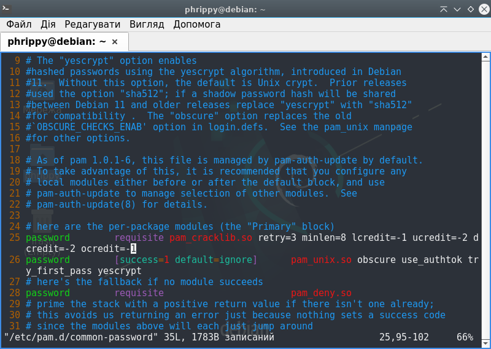
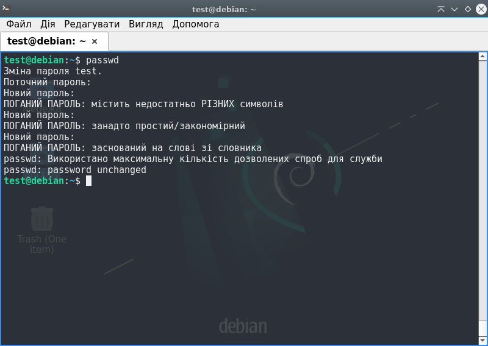
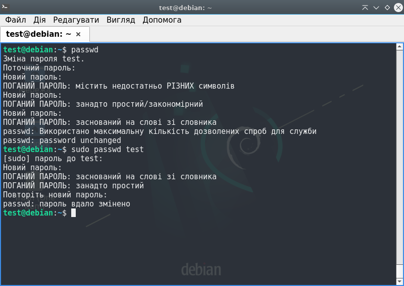
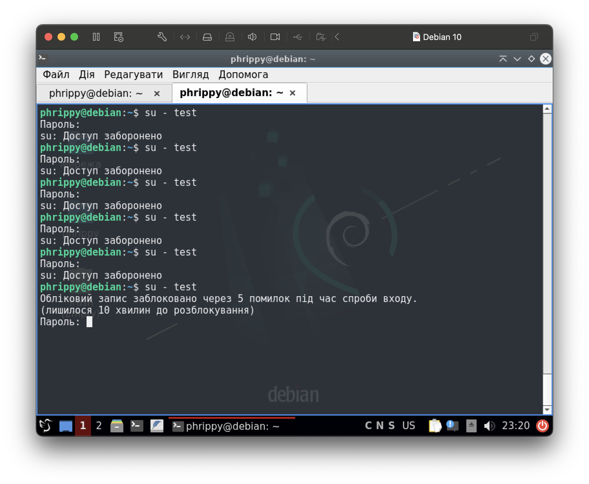
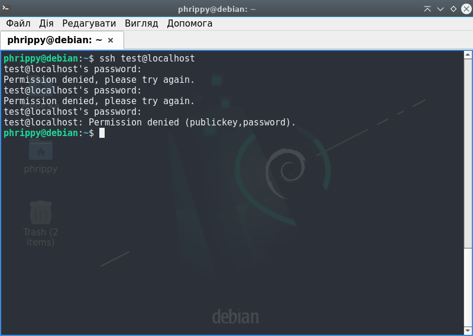
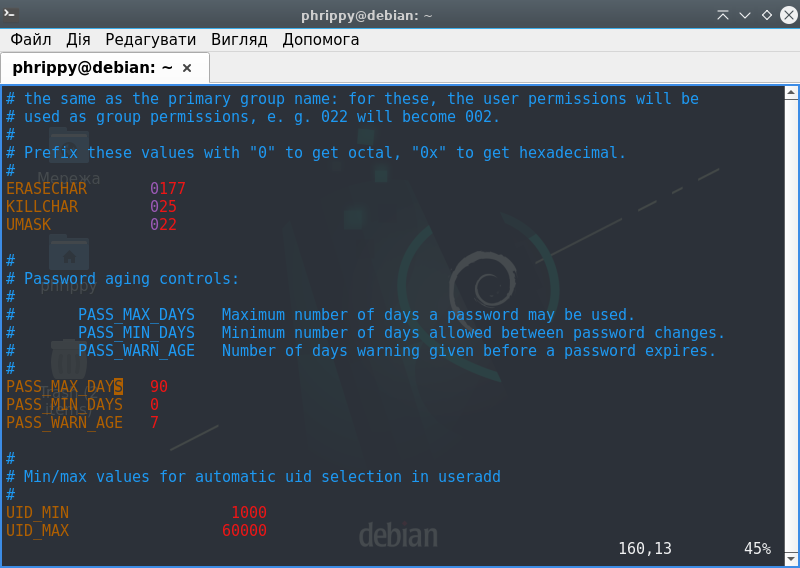
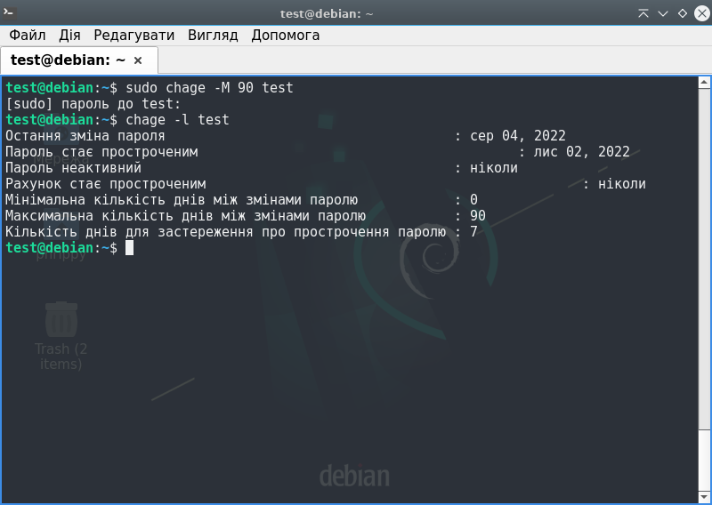

# Памʼятати останні 4 паролі
Для запам'ятовування старих паролів використовуються два pam-модулі:
1. `pam_unix.so`
2. `pam_pwhistory.so`

В обох випадках старі паролі зберігатимуться в файлі `/etc/security/opasswd/<імʼя користувача>`. Очевидно, було б нерозумно використовувати ці модулі одночасно

## Модуль pam_unix.so
Редагуємо файл `/etc/pam.d/common-password`. Знаходимо рядок, де відбувається виклик модулю `pam_unix.so` з типом `password` (в нашому випадку це рядок 25). Дописуємо в ньому через пробіл `remember=4`

Повинно вийти так:
```diff
- password        [success=1 default=ignore]      pam_unix.so obscure yescrypt
+ password        [success=1 default=ignore]      pam_unix.so obscure yescrypt remember=4
```


Налаштування запрацюють після збереження файлу. Але є одна проблема: цей модуль не працює з суперкористувачем. Якщо потрібно обмежити і суперкористувача, потрібно використовувати модуль `pam_pwhistory.so`

## Модуль pam_pwhistory.so
Ключова відмінність від попереднього модуля - підримка обмежень в тому числі і для суперкористувача.

Редагуємо той же самий файл `/etc/pam.d/common-password`, але в цьому варіанті не редагуємо відповідний рядок, а додаємо новий рядок над ним. Повинно вийти так:
```diff
+ password        required pam_pwhistory.so remember=4
  password        [success=1 default=ignore]      pam_unix.so obscure yescryp
```

Щоб обмежитити і суперкористувача (заради чого ми, власне, і зібралися використовувати модуль `pam_pwhistory.so`), треба додати параметр `enforce_for_root`. Дописуємо цей параметр через пробіл в кінець рядка, в якому викликається модуль `pam_pwhistory.so` з типом `password`

Кінцевий рабочий варіант виглядатиме так:

```diff
+ password        required pam_pwhistory.so remember=4 enforce_for_root
  password        [success=1 default=ignore]      pam_unix.so obscure yescryp
```


Для тесту створимо нового користувача, одразу задавши йому оболонку за замовчуванням і створивши домашній каталог. Також встановимо йому пароль

```bash
sudo useradd -m -s /bin/bash test
sudo passwd test
```

При спробі змінити пароль на один із чотирьох збережених отримаємо очікувану помилку


Оскільки останні паролі користувача `test` зберігаються в файлі `/etc/security/opasswd/test`, то при видаленні цього файлу користувач знову зможе встановити один з чотирьох останніх паролів. На практиці так робити не варто

Якщо вимкнена опція `enforce_for_root` або використувується модуть `pam_unix.so`, суперкористувач може назначати повторні паролі як собі, так і іншим користувачам

___

# Вимоги до паролів

Для встановлення вимог до паролів будемо використувувати модуль `pam_cracklib`. В базовій поставці я його не знайшов, тому довелось встановити з репозиторію
```bash
sudo apt install libpam-cracklib
```

В процесі встановлення пакету  файл `/etc/pam.d/common-password` було змінено:

```diff
  # here are the per-package modules (the "Primary" block)
+ password        requisite                       pam_cracklib.so retry=3 minlen=8 difok=3
- password        [success=1 default=ignore]      pam_unix.so obscure yescrypt
+ password        [success=1 default=ignore]      pam_unix.so obscure use_authtok try_first_pass yescrypt
  # here's the fallback if no module succeeds
  password        requisite                       pam_deny.so
```

В принципі, цього достатньо для функціонування модулю, обмеження на нові паролі вже працюють. Відредагуємо файл відповідно до завдання:

```diff
  # here are the per-package modules (the "Primary" block)
- password        requisite                       pam_cracklib.so retry=3 minlen=8 difok=3
+ password        requisite                       pam_cracklib.so retry=3 minlen=8 lcredit=-1 ucredit=-2 dcredit=-2 ocredit=-1
  password        [success=1 default=ignore]      pam_unix.so obscure use_authtok try_first_pass yescrypt
  # here's the fallback if no module succeeds
  password        requisite                       pam_deny.so
```



Спробуємо встановити паролі, що не відповідають новій політиці:



До речі, якщо змінювати пароль, використовуючи права суперкористувача, то пароль буде встановлено, ігноруючи обмеження `pam_cracklib`. Але буде виведено попередження



___

# Блокуємо користувача після 5 введень неправильного паролю
Для цього використовуватимемо модудь `pam_faillock`. Щоб його налаштувати, додамо відповідні рядки в файл `/etc/pam.d/common-auth`

```diff
+ auth     required       pam_faillock.so preauth
  auth    [success=1 default=ignore]      pam_unix.so nullok
+ auth     [default=die]  pam_faillock.so authfail
+ auth     sufficient     pam_faillock.so authsucc
  # here's the fallback if no module succeeds
  auth    requisite                       pam_deny.so
+ account  required       pam_faillock.so
```


Для налаштування `pam_faillock` потрібно відредагувати файл `/etc/security/faillock.conf`.

Треба задати параметр `deny` рівним 5. Інші параметри можна залишити за замовчуванням

```diff
  # Deny access if the number of consecutive authentication failures
  # for this user during the recent interval exceeds n tries.
  # The default is 3.
- # deny = 3
+ deny = 5
  #
```

Після невдалого введення паролю 5 разів ( `deny = 5` ) на протязі 15 хвилин ( `fail_interval = 900` ) аккаунт буде заблоковано на 10 хвилин ( `unlock_time = 600` )



При віддаленому логіні примусово вмикається опція `silent` і факт блокування користувачу не повідомляється, незалежно від правильності паролю відповідь буде "Доступ заборонено". Така поведінка доцільна з точки зору безпеки



* Інформація про невдалі логіни буде зберігатися в каталозі `/var/run/faillock/`
* Також доступна команда `faillock`, яка фактично відображає вміст цього каталогу в зручному форматі
* Для моментального розблокування користувача можна видалити файл `/var/run/faillock/<username>` або запустити команду `faillock --reset --user <username>`, де `<username>` - імʼя заблокованого користувача
___

# Час життя паролю - 90 днів

Щоб задати час життя паролю для нових користувачів, потрібно змінити файл `/etc/login.defs`, задавши значення параметру `PASS_MAX_DAYS` рівним 90

```diff
- PASS_MAX_DAYS   99999
+ PASS_MAX_DAYS   90
```




Але це налаштування для майбутніх користувачів. Для вже існуючих користувачів параметр був збережений в файлі `/etc/shadow` в момент створення користувача. Якщо потрібно змінити максимальну тривалість життя паролю для вже існуючого користувача, потрібно скористатися командою `sudo chage -M 90 <username>`, де `<username>` - імʼя конкретного користувача.

Щоб дізнатись поточні обмеження користувача, потрібно скористатися командою `sudo chage -l <username>`. Якщо запитується інформація про поточного користувача, можна `sudo` опустити


