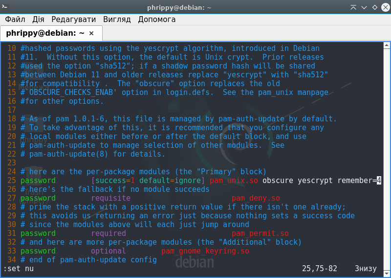
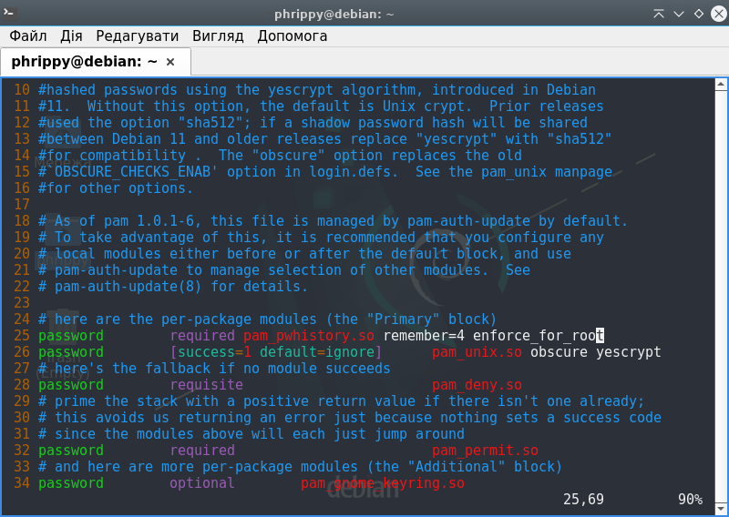
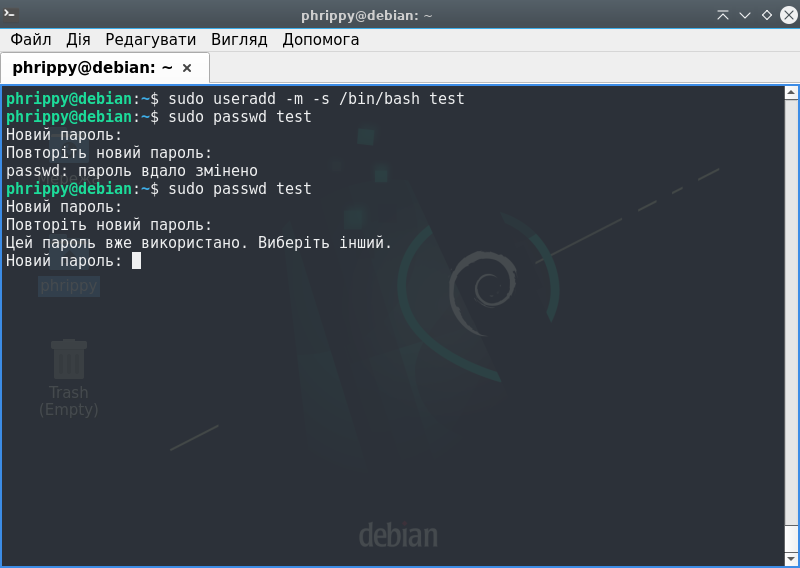
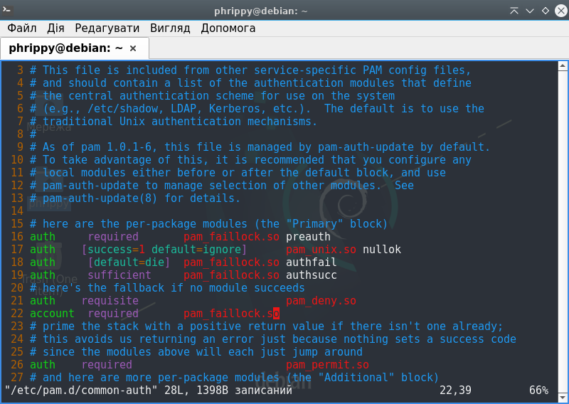

# Памʼятати останні 4 паролі
Для запам'ятовування старих паролів використовуються два pam-модулі:
1. `pam_unix.so`
2. `pam_pwhistory.so`

В обох випадках старі паролі зберігатимуться в файлі `/etc/security/opasswd/<імʼя користувача>`. Очевидно, було б нерозумно використовувати ці модулі одночасно

## Модуль pam_unix.so
Редагуємо файл `/etc/pam.d/common-password`. Знаходимо рядок, де відбувається виклик модулю `pam_unix.so` з типом `password` (в нашому випадку це рядок 25). Дописуємо в ньому через пробіл `remember=4`

Повинно вийти так:
```diff
- password        [success=1 default=ignore]      pam_unix.so obscure yescrypt
+ password        [success=1 default=ignore]      pam_unix.so obscure yescrypt remember=4
```



Налаштування запрацюють після збереження файлу. Але є одна проблема: цей модуль не працює з суперкористувачем. Якщо потрібно обмежити і суперкористувача, потрібно використовувати модуль `pam_pwhistory.so`

## Модуль pam_pwhistory.so
Ключова відмінність від попереднього модуля - підримка обмежень в тому числі і для суперкористувача.

Редагуємо той же самий файл `/etc/pam.d/common-password`, але в цьому варіанті не редагуємо відповідний рядок, а додаємо новий рядок над ним. Повинно вийти так:
```diff
+ password        required pam_pwhistory.so remember=4
  password        [success=1 default=ignore]      pam_unix.so obscure yescryp
```

Щоб обмежитити і суперкористувача (заради чого ми, власне, і зібралися використовувати модуль `pam_pwhistory.so`, треба додати параметр `enforce_for_root`. Дописуємо цей параметр через пробіл в кінець рядка, в якому викликається модуль `pam_pwhistory.so` з типом `password`

Кінцевий рабочий варіант виглядатиме так:

```diff
+ password        required pam_pwhistory.so remember=4 enforce_for_root
  password        [success=1 default=ignore]      pam_unix.so obscure yescryp
```



Для тесту створимо нового користувача, одразу задавши йому оболонку за замовчуванням і створивши домашній каталог. Також встановимо йому пароль

```bash
sudo useradd -m -s /bin/bash test
sudo passwd test
```

При спробі змінити пароль на один із чотирьох збережених отримаємо очікувану помилку



Оскільки останні паролі користувача `test` зберігаються в файлі `/etc/security/opasswd/test`, то при видаленні цього файлу користувач знову зможе встановити один з чотирьох останніх паролів. На практиці так робити не варто

Якщо вимкнена опція `enforce_for_root` або використувується модуть `pam_unix.so` суперкористувач може назначати повторні паролі як собі, так і іншим користувачам

___

# Вимоги до паролів

Для встановлення вимог до паролів будемо використувувати модуль `pam_cracklib`. В базовій поставці я його не знайшов, тому довелось встановити з репозиторію
```bash
sudo apt install libpam-cracklib
```

___

# Блокуємо користувача після 5 введень неправильного паролю
Для цього використовуватимемо модудь `pam_faillock`. Щоб його налаштувати, додамо відповідні рядки в файл `/etc/pam.d/common-auth`



```diff
+ auth     requisite       pam_faillock.so preauth
  auth    [success=1 default=ignore]      pam_unix.so nullok
+ auth     sufficient     pam_faillock.so authsucc
  # here's the fallback if no module succeeds
  auth    requisite                       pam_deny.so
+ account  required       pam_faillock.so
```

* Інформація про невдалі логіни буде зберігатися в каталозі `/var/run/faillock/`
* Також доступна команда `faillock`, яка фактично відображає вміст цього каталогу в зручному форматі
___

# Час життя паролю - 90 днів

Щоб задати час життя паролю для нових користувачів, потрібно змінити файл `/etc/login.defs`, задавши значення параметру `PASS_MAX_DAYS` рівним 90

```diff
- PASS_MAX_DAYS   99999
+ PASS_MAX_DAYS   90
```

Але це налаштування для майбутніх користувачів. Для вже існуючих користувачів параметр був збережений в файлі `/etc/shadow`. Якщо потрібно змінити максимальну тривалість життя паролю для вже існуючого користувача, потрібно скористатися командою `sudo chage -M 90 <username>`, де `<username>` - імʼя конкретного користувача.

Щоб дізнатись поточні обмеження користувача, потрібно скористатися командою `sudo chage -l <username>`. Якщо запитується інформація про поточного користувача, можна `sudo` опустити
