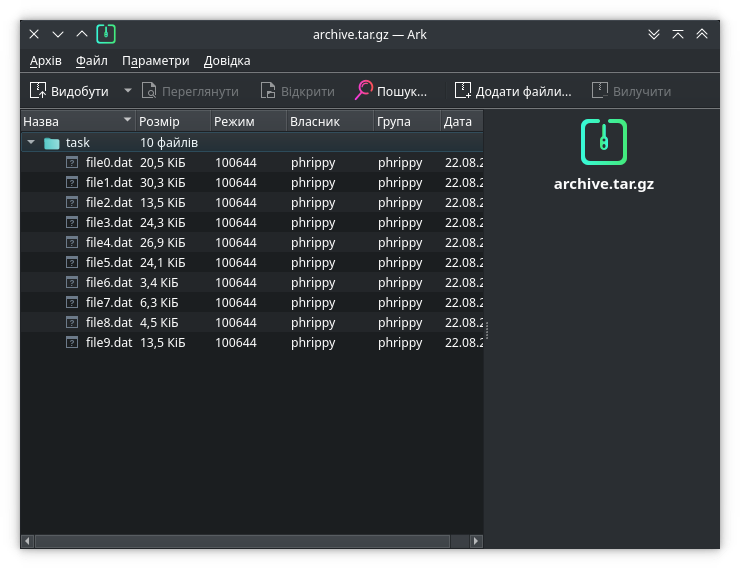
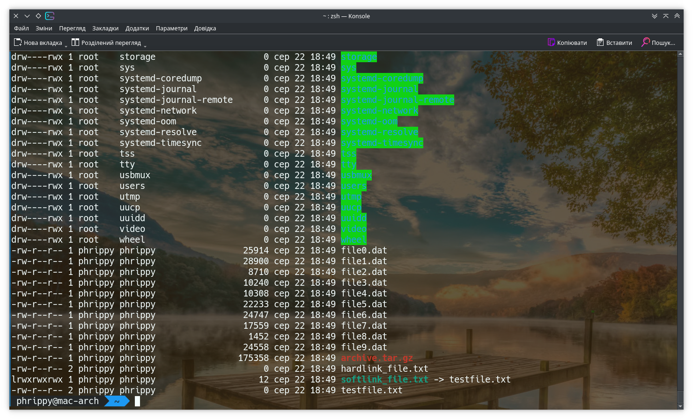

Создать пользователя:

попробовать создать скрипт, который создаст пользователя, задаст ему пароль и добавит ему права sudo

Создать баш скрипт, который:

* создает в домашней папке пользователя папку task
* определяет все группы, доступные в системе и создает подпапки в папке task - имя папки = название группы.
* выставить для папок владельцем пользователя root группу - соответствующую группу и разрешения 607
* установит SGID и sticky bit для папки task
* создать файл test (можно другое имя), создать хард линк и софт линк к этому файлу
* создать 10 файлов, заархивировать их архиватором tar и сжать gzip (архив должен содержать папку, в которой расположены эти файлы)

Отчет - текст скрипта и скриншот с файловой структурой.

# Скрипт створення користувача
```bash
#!/bin/bash

create () {
  # Одразу перевіряємо, чи існує користувач з таким іменем
  # Якщо існує - завершуємо роботу
  if id -u "${1}" >/dev/null 2>&1; then
   echo "Username ${1} is already exist" >&2
   echo "Please choose another username" >&2
   exit 201
  fi

  echo "Creating user ${1}..."
  useradd --create-home --shell /bin/bash ${USERNAME}

  echo "Adding ${1} to sudoers..."
  echo "${1} ALL=(ALL:ALL) ALL" > "/etc/sudoers.d/$1"

  if [ $(type -t echo) != 'builtin' ] ; then
    echo "'echo' is not builtin command. It is $(which echo)" >&2
    echo 'Cannot set password. Exiting...' >&2
    exit 202
  fi

  echo "Setting password for ${USERNAME}..."
  echo -n "${1}:${2}" | chpasswd
  exit 0
}

delete () {
  echo "Deleting ${1}..."
  userdel -r ${1} >/dev/null 2>&1
  rm -fv "/etc/sudoers.d/${1}"
}

# Підтримка короткої довідки
# Потрібно викликати скрипт з параметрами -h або --help
help () {
  echo "Usage:"
  echo "$(basename $0) [ -c | --create ] username [password]"
  echo "$(basename $0) [ -d | --delete ] username"
  echo "$(basename $0) [ -h | --help ]"
}

case "${1}" in
  -h|--help)
    help
    exit 0
    ;;
  -d|--delete)
    # Буде запущено видалення користувача 
    MODE=delete
    shift
    ;;
  -c|--create)
    # Опція за замовчуванням, зробив для краси
    shift
    ;;
  *)
    # Буде запущено створення користувача 
esac

# Оскільки створювати нового користувача можна тільки від імені суперкористувача
# то ми просто завершимо роботу скрипта
if [[ $EUID -ne 0 ]] ; then
  echo 'Please run this script as root'
  exit 200
fi


# Ім'я і пароль нового користувача задаються як параметри скрипта
# Якщо параметри не задано, буде використано значення за замовучанням
DEFAULT_USERNAME=john
DEFAULT_PASSWORD=qwerty
USERNAME=${1-${DEFAULT_USERNAME}}
PASSWORD=${2-${DEFAULT_PASSWORD}}

${MODE-create} "${USERNAME}" "${PASSWORD}"
echo Done!
```

# Скрипт створення каталогу task

```bash
#!/bin/bash

# Якщо в домашньому каталозі не існує об'єкту з ім'ям task
# то створимо каталог з таким ім'ям
DIRECTORY="$HOME/task"
if [[ ! -e "${DIRECTORY}" ]] ; then
  mkdir -pv "${DIRECTORY}"
fi

# Якщо ж такий об'єкт вже існує і це не каталог
# то аварійно завершимо роботу
if [[ ! -d "${DIRECTORY}" ]] ; then
 echo "${DIRECTORY} is not directory!"
 echo "Aborting..."
 exit 1
fi

# Два варіанти, щоб дістати список груп
# Можна було б скористатися командою groups,
# але вона повертає список тільки тих груп, в яких користувач учасник
groups1=$(cat /etc/group | grep -oP '^.*?(?=(:))')
groups2=$(cat /etc/group | tr ':' ' ' | awk '{print $1}')

# Створюємо в цільовому каталозі каталоги з іменами груп
for i in $groups1
  do
    mkdir -pv "${DIRECTORY}/$i"
done

# Встановлюємо права власника відповідно до завдання
# Ця операція потребує прав суперкористувача, тому запускаємо через sudo
for i in "${DIRECTORY}"/*
  do
    sudo chown -v root:$(basename "$i") "${i}"
    sudo chmod -v 607 "${i}"
done

# Додаємо до цільового каталогу біти sguid і sticky
sudo chmod -v g+s "${DIRECTORY}"
sudo chmod -v o+t "${DIRECTORY}"

# Створюємо тестовий файл і жорстке та м'яке посилання на нього
touch "${DIRECTORY}/testfile.txt"
ln --physical --verbose "${DIRECTORY}/testfile.txt" "${DIRECTORY}/hardlink_file.txt"
ln --symbolic --relative --verbose "${DIRECTORY}/testfile.txt" "${DIRECTORY}/softlink_file.txt"

# Створюємо десять файлів з випадковим розміром і даними
for i in {0..9}
  do
    dd if=/dev/urandom of="$DIRECTORY/file${i}.dat" bs=1 count=$RANDOM
done

# Переходимо в каталог зі згенерованими файлами
cd "${DIRECTORY}"/..
# Генеруємо tar.gz архів із цими файлами
tar cvzf "${DIRECTORY}/archive.tar.gz" $(basename $DIRECTORY)/*.dat
# За потреби додати специфічні опції стиснення
# чи для використання компресора, який не підтримується tar
# можна використовувати альтернативний синтаксис:
# tar cf - $(basename $DIRECTORY)/*.dat | gzip -9 > "${DIRECTORY}/archive.tar.gz"
```

В результаті отримаємо архів з такою структурою файлів:



Структура файлів і каталогів, отримана за допомогою команди `ls -l --sort=extension task`:


