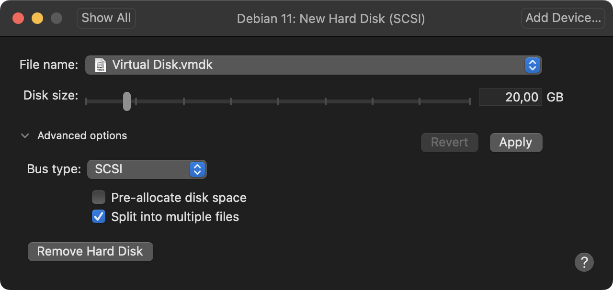
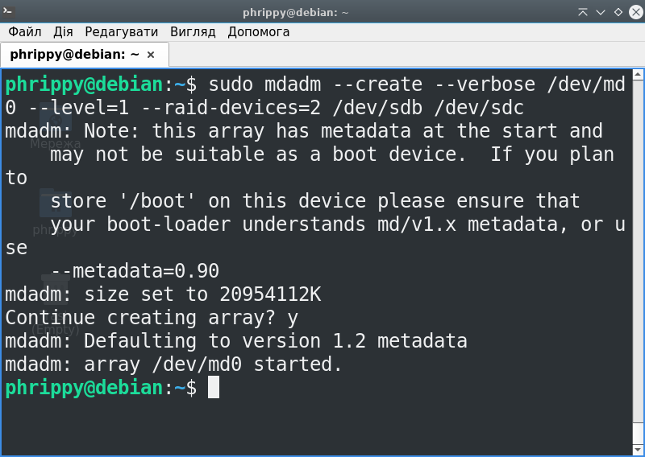
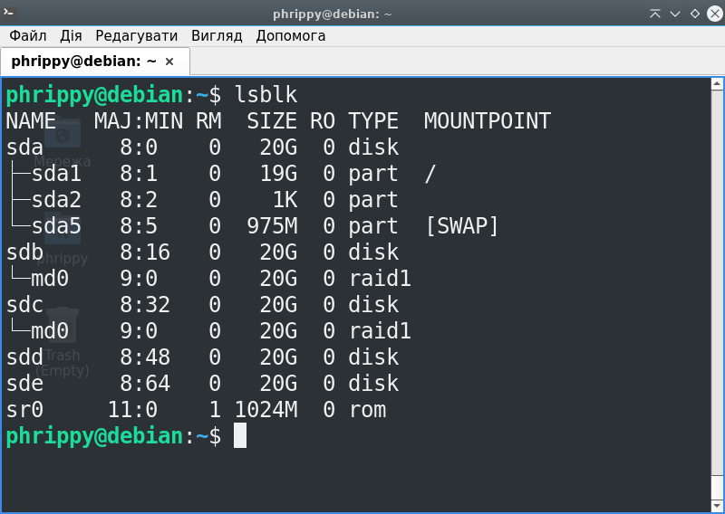
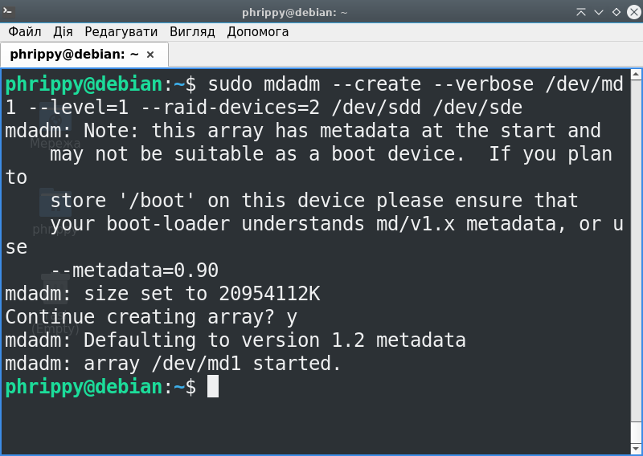

# Робота з software RAID
Додамо 4 віртуальних жорстких диски у віртуальну машину, попередньо при цьому вимкнувши її. Оскільки ми не збираємося заповнювати під завʼязку результуючу файлову систему даними, можна залишити параметри за замовчуванням. Чотири віртуальних пристрої займатимуть не 80 Гб, а стільки, скільки реально записано на них даних - головне переконатися, що прапорець `Pre-allocate disk space` знятий



Після додавання віртуальних носіїв завантажимо віртуальну машину і перевіримо стан справ командою `lsblk`. Як бачимо, до нашого пристрою `/dev/sda` додалися пристрої `/dev/sdb`, `/dev/sdc`, `/dev/sdd` та `/dev/sde`.


Утиліти mdadm в стандартній поставці немає, тому швидко її встановимо одним рядком:
```bash
sudo apt update && sudo apt -y install mdadm
```

## Для початку створимо RAID1
Для цього запустимо команду
```bash
sudo mdadm --create --verbose /dev/md0 --level=1 --raid-devices=2 /dev/sdb /dev/sdc
```



Після створення RAID-масиву вивід команди `lsblk` виглядає набагато цікавіше. Додалася інформація, що пристрої `/dev/sdb` та `/dev/sdc` є складовою віртуального RAID0-пристрою.



В принципі, тепер можна створити на цьому пристрої файлову систему командою `sudo mkfs.ext4 /dev/md0`, а потім змонтувати її і перевірити вільний простір. В кінці обовʼязково треба розмонтувати її, оскільки ми сюди прийшли не за цим і пристрій `/dev/md0` нам ще знадобиться


## Створюємо ще один RAID1 масив
Використаємо інші два віртуальні HDD
```bash
sudo mdadm --create --verbose /dev/md1 --level=1 --raid-devices=2 /dev/sdd /dev/sde
```


Тепер вивід команди `lsblk` виглядає так:


# Робота з LVM
## Встановлення LVM в систему
LVM немає в базовій системі, так само, як і mdadm. При спробі встановити lvm, пакетний менеджер повідомляє, що такого пакета не існує. Але очевидно, що його назва починається з 'lvm'

Скориставшись швидким пошуком за допомогою команди `apt search --names-only '^lvm'` отримаємо однозначну відповідь - пакет називається `lvm2`


Запустимо команду `sudo apt update && sudo apt -y install mdadm` і почнемо роботу з LVM

## Створюємо логічний LVM-том поверх двох RAID-масивів
*TODO*

## Форматуємо логічний том в EXT4
*Увага, не всі фс підтримують дискові квоти Linux!*

*TODO*

# Робота з user quota
## Монтування командою `mount`
## Монтування через `/etc/fstab`
## Вмикання квот
## Налаштування обмежень для користувача
## Налаштування обмежень для групи
## Вивід поточних обмежень
## Спроба перевищити обмеження
