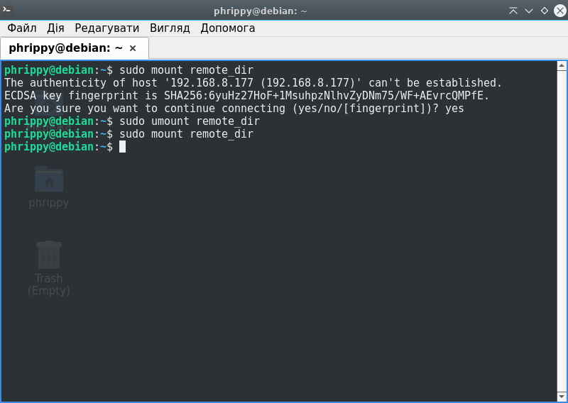
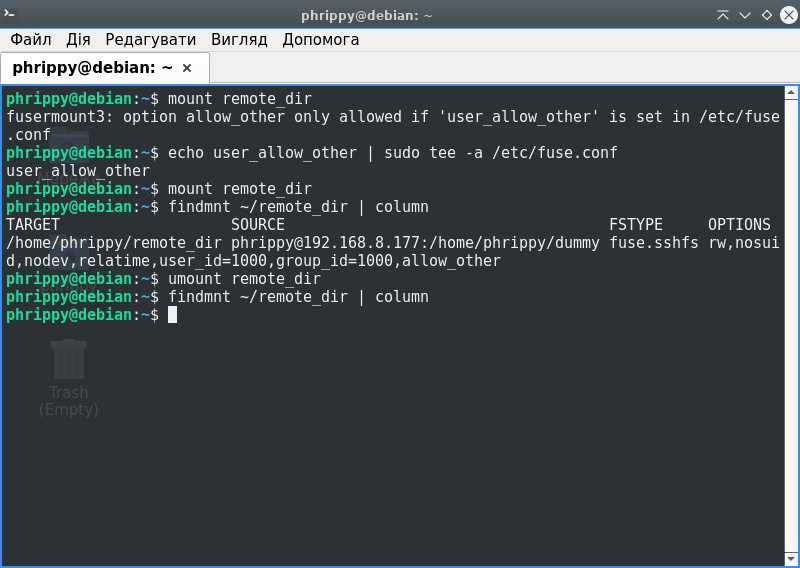

# Генерація ключа
Для підключення до віддаленої машини по ssh, нам спочатку потрібно згенерувати ключ. Запускаємо команду
```bash
ssh-keygen -t rsa -f ~/.ssh/arch
```


# Копіювання ключа на інший хост
Для початку сконфігуруємо наш хост, додавши відповідні рядки в `~/.ssh/config`:

```bash
# Коротка назва хосту, яку будемо використовувати при підключенні
Host arch
	# Адреса хосту для доступу
	HostName	192.168.8.177
	# Ім'я користувача. Якщо не ввести, буде використано ім'я поточного користувача
	User		phrippy
	# Шлях до файлу з ключем, який ми попередньо згенерували
	# Звісно, можна генерувати ключ за стандартним ім'ям і розміщенням, а потім опускати цей рядок
	# Але це погана практика. В ідеалі, один сервер - один ключ
	IdentityFile	~/.ssh/arch
```
Оскільки все налаштовано, тепер достатньо дати команду `ssh-copy-id -i ~/.ssh/arch arch`. Варто зазначити, що хоча ми вказали файл приватного ключа, на віддалений хост було скопійовано публічний ключ. Якщо вказати публічний ключ (`ssh-copy-id -i ~/.ssh/arch.pub arch`) - результат буде той самий: нас запитають пароль:


Того ж ефекту можна добитися, якщо передати ключ вручну: `cat ~/.ssh/sshfs_key.pub | ssh 'tee -a ~/.ssh/authorized_keys'`. Фактично, команда `ssh-copy-id` саме це і робить

Якщо парольний доступ для root заборонений, можна передати свій ключ через sudo: `cat ~/.ssh/arch.pub | ssh from 'sudo tee -a ~root/.ssh/authorized_keys'`. Не знаю, чи поширена така практика в реальних умовах, але це працює - ми матимемо безпарольний доступ до користувача root на віддаленій машині. Якщо, звісно, опція `PermitRootLogin` в файлі `/etc/ssh/sshd_config` не встановлена в `no`.

# Забороняємо доступ по паролю
Редагуємо файл `/etc/ssh/sshd_config`. Треба розкоментувати рядок `PasswordAuthentication yes` і замінити `yes` на `no`:

```diff
  # To disable tunneled clear text passwords, change to no here!
- #PasswordAuthentication yes
+ PasswordAuthentication no
  #PermitEmptyPasswords no
```

Для того, щоб демон sshd перечитав свій конфігураційний файл, потрібно надіслати йому сигнал HUP, або просто перезапустити його. Зазвичай для цього користуються командою `sudo systemctl reload sshd`. Варто зазначити, що на поточні з'єднання ні перезавантаження демона, ні, тим більше, сигнал HUP не вплинуть.

# Монтуємо каталог через sshfs
Для початку створимо директорію, куда змонтуємо файлову систему віддаленого хоста.

```bash
mkdir ~/remote_dir
```

Тепер спробуємо змонтувати віддалений каталог за допомогою sshfs:

```bash
sshfs arch:/home/phrippy/dummy ~/remote_dir
```


Як бачимо, все працює. На змонтованій файловій системі ми маємо такі ж права, як і віддалений користувач. Щоб перевірити, що наш каталог тепер є точкою монтування, є команда `findmnt`

Щоб відмонтувати, можна скористатись командою `umount ~/remote_dir`. Хоча офіційна документація рекомендує `fusermount -u ./remote_dir`

Можна монтувати такий каталог при старті системи, якщо додати відповідний рядок в файл `/etc/fstab`:

```
phrippy@192.168.8.177:/home/phrippy/dummy /home/phrippy/remote_dir sshfs defaults,_netdev,IdentityFile=/home/phrippy/.ssh/arch,allow_other 0 0
```

Після цього обов'язково потрібно перший раз змонтувати такий каталог вручну, щоб інформація про віддалений хост додалася в файл `/root/.ssh/authorized_keys`. В подальшому монтування буде автоматичним і неінтерактивним. Щоб можна було писати аліас віддаленого хоста, потрібно дописати вміст файлу `~/.ssh/config` до `/root/.ssh/config` або `/etc/ssh/ssh_config`



Щоб дозволити монтувати і демонтувати такі каталоги без `sudo`, достатньо команди `echo user_allow_other | sudo tee -a /etc/fuse.conf`


