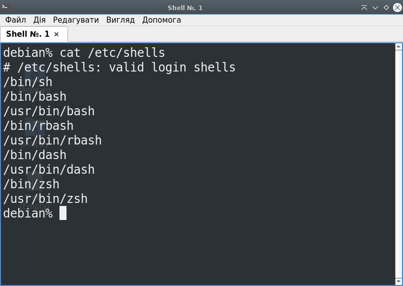
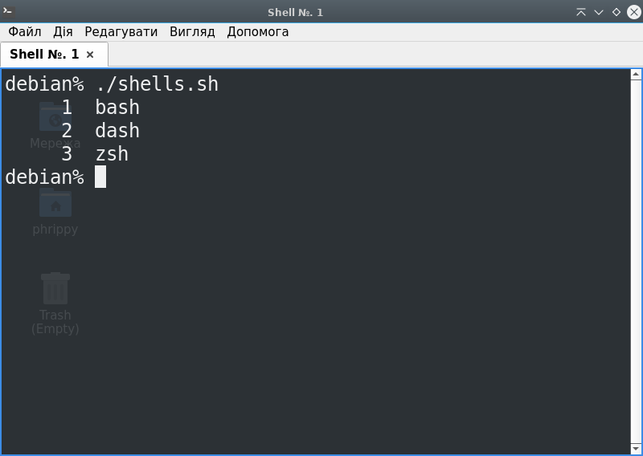
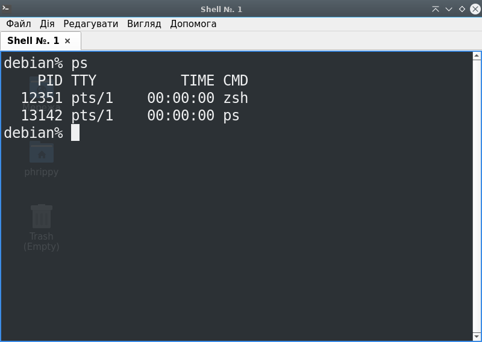
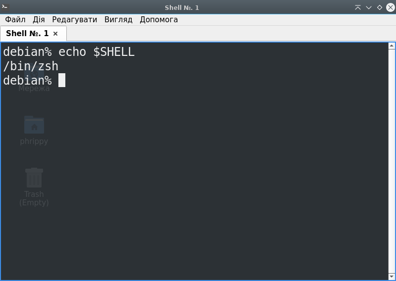
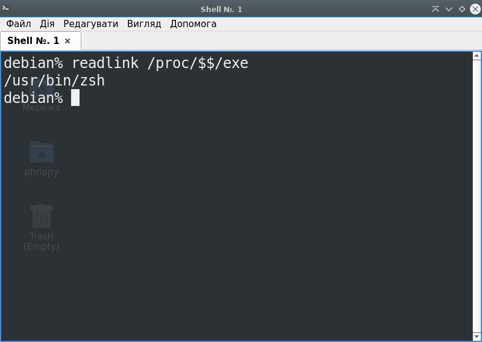
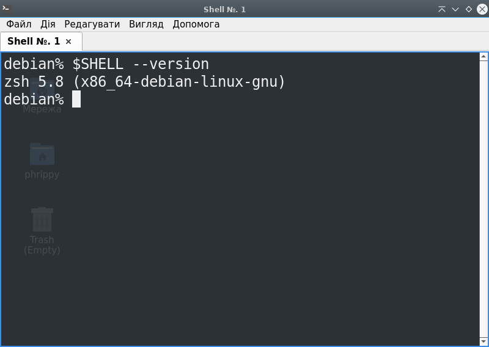
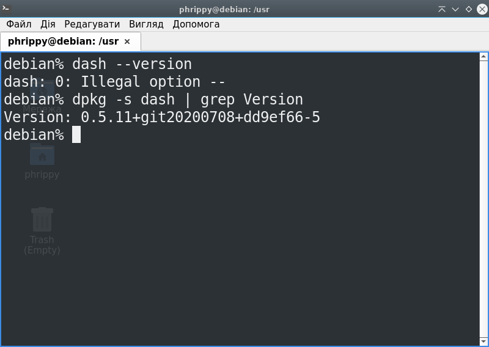
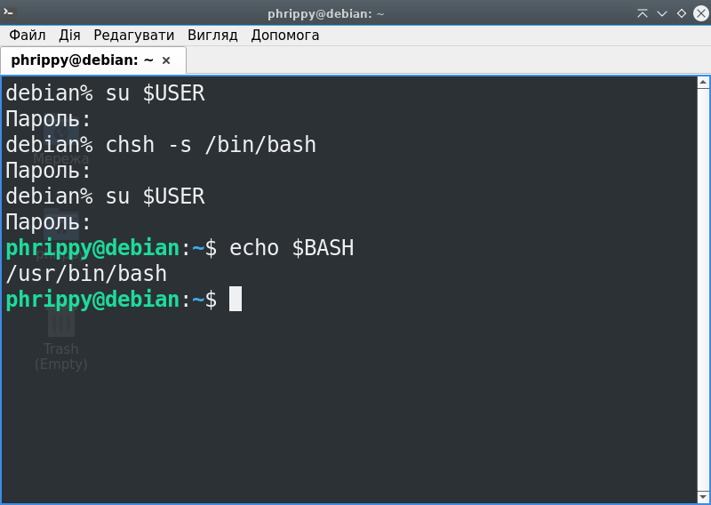
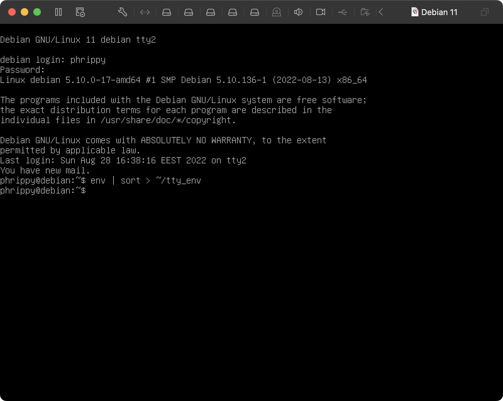
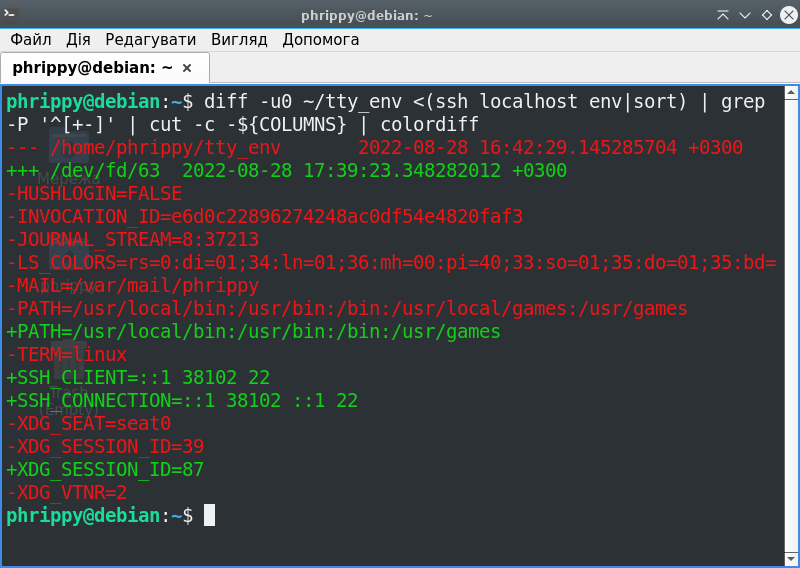

# Перевіряємо скільки і які шелли встановлені в системі:

```cat /etc/shells```



Якась дичина. Виявляється, деякі файли і каталоги в цьому списку є символічними посиланнями. Що ж, напишемо скрипт, який коректно виведе встановлені в системі шелли:

```bash
#!/bin/bash
for i in $(
  cat /etc/shells | # Зчитуємо файл зі списком шеллів
  grep -P '^[^#]'   # Прибираємо коментарі
  )
do
  # Якщо файл чи каталог, в якому знаходиться цей файл
  # не є символічним посиланням
  if [ ! -L $i ] && [ ! -L $(dirname $i) ]; then
    echo $(basename $i)  # То виводимо на stdout назву шелла
  fi
done |
cat -n # Додаємо номери рядків
```

* Тепер вивід виглядає набагато краще:



# Поточний шелл можна дізнатися командою `ps`:



# Вміст змінної $SHELL дізнаємося командою `echo $SHELL`:



# Також поточний шелл можна дізнатися командою readlink:

```readlink /proc/$$/exe```

* `$$` - це змінна, що зберігає PID поточного процесу
* Файл /proc/<PID процесу>/exe є символічним посиланням на файл, з якого процес був запущений
* Команда `readlink` зчитує символічне посилання і повертає цільовий шлях до файлу
* Як бачимо, хоча шелл у нас `/bin/zsh`, команда вивела `/usr/bin/zsh`, оскільки в моїй системі каталог `/bin` є символічним посиланням на `/usr/bin`



# Перевірка поточної версії шелла
Можна скористатись командою `$SHELL --version`, але вона не є універсальною:



## Альтернативний варіант

Шелл dash настільки вбогий, що не розуміє опцію `--version`. Тому за потреби доведеться скористатися послугами пакетного менеджера:



# Змінюємо шелл за замовчуванням на bash

```chsh -s /bin/bash```



# Дістаємо список змінних середовища
Для цього просто запустимо команду `env`


# Порівнюємо змінні середовища із tty і ssh сесій
* Змінні середовища із tty можна дістати, залогінившись в tty. Відсортуємо їх і запишемо в файл:



1. Змінні середовища із ssh можна дістати навіть в графічному терміналі
1.1. Для цього потрібно виконати команду `ssh localhost env`. Тому в файл їх писати не будемо, а одразу передамо на вивід команді diff:

2. u означає виводити дані в форматі git
3. 0 - кількіть унікальних рядків, які буде виведено. Нас цікавлять тільки відмінності, тому ставимо нуль
4. Оскільки команда `diff` не працює з stdin, доведеться скористатися функцією нелінійного конвеєра:
4.1. конструкція `<(command)` означає виконати `command`, записати її вивід в тимчасовий файл в каталозі `/dev/fd` і передати цей файл команді `diff` як аргумент
5. Команда cut обріже довгий рядок змінної $LS_COLORS
6. colordiff розфарбує вивід

```diff -u0 ~/tty_env <(ssh localhost env|sort) | grep -P '^[+-]' | cut -c -${COLUMNS} | colordiff```



* Отримаємо різницю двох середовищ.
* "Видалені" рядки - це змінні середовища в tty, а "додані" - це змінні середовища в ssh

```diff
--- /home/phrippy/tty_env       2022-08-28 16:42:29.145285704 +0300
+++ /dev/fd/63  2022-08-28 17:39:23.348282012 +0300
-HUSHLOGIN=FALSE
-INVOCATION_ID=e6d0c22896274248ac0df54e4820faf3
-JOURNAL_STREAM=8:37213
-LS_COLORS=rs=0:di=01;34:ln=01;36:mh=00:pi=40;33:so=01;35:do=01;35:bd=
-MAIL=/var/mail/phrippy
-PATH=/usr/local/bin:/usr/bin:/bin:/usr/local/games:/usr/games
+PATH=/usr/local/bin:/usr/bin:/bin:/usr/games
-TERM=linux
+SSH_CLIENT=::1 38102 22
+SSH_CONNECTION=::1 38102 ::1 22
-XDG_SEAT=seat0
-XDG_SESSION_ID=39
+XDG_SESSION_ID=87
-XDG_VTNR=2
```
