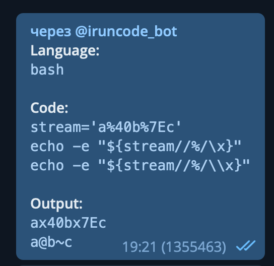

`--shell script start--`

```bash
#!/bin/bash
# Це заголовок скрипта, він же sha-bang. Скрипт буде віддано на обробку утиліті /bin/bash
# Фактично це означає, що буде виконана команда /bin/bash <scriptname>
# В принципі, тут можна написати абсолютний шлях до будь-якого файлу з бітом executable і будь-якими параметрами і атрибутами

Q="$@"
# Присвоюємо змінній $Q значення, що були передані скрипту, як параметри

URL='https://www.ya.ru/search?tbs=li:1&q='
# Значення змінної $URL встановлюється у відповідний текстовий рядок

AGENT="Mozilla/4.0"
# Те ж саме для змінної $AGENT

stream=$(
# В змінну $stream записується результат виконання  набору команд з конструкції $()

curl -A "$AGENT"
# Запускаємо curl. В якості юзер-агента передаємо значення змінної $AGENT

-s # Тихий режим, виводити тільки скачані дані
k  # Ігнорувати всі помилки сертифікатів
L  # Якщо посилання перенаправляє нас на нове посилання, то автоматично переходити за ним, а не завершувати роботу
m 10 # Обмежити час роботи десятьма секундами
  
# Збираємо текстовий рядок. Беремо значення змінної $URL
"${URL}
${Q//\ /+}" # Беремо значення змінної $Q і замінюємо всі пробіли на знак плюс. Не зрозузуміло навіщо бекслеш, тут пробіл екранувати не потрібно
  
| grep -oP '\/url\?q=.+?&amp' # Шукаємо рядок за регулярним виразом в форматі Perl (-P). Відображаємо тільки те, що підпадає під вираз, а не весь рядок (-o)
| sed 's|/url?q=||; s|&amp||') # Замінюємо в знайденому спочатку '/url?q=' а потім '&amp' на пустий рядок. Тобто видаляємо їх.

echo -e # Інтерпретуємо зворотні похилі риски
"${stream//\%/\x}" # Беремо змінну $steam і замінюємо '%' на '\x'. Значок відсотка екранувати не потрібно.
# А бекслеш потрібно, інакше скрипт може стати не переносним. Знайшов платформу, де некранований бекслеш викликає проблеми:
```



`--shell script end--`

Сенс скрипта такий:
* Передаємо йому текст, попередньо замінивши пробіли на плюси, якщо того потребує стандарт GET-запитів
* Скрипт шукає текст через ya.ru.
* Парсимо відповідь сервера (насправді тільки першу сторінку результатів пошуку)
* Видобуваємо текст, обмежений зліва `/url\?q=` і справа `&amp`
* Замінюємо в тексті знак відсотка на `\x`.

  тобто `%7E` (формат екранування в адресному рядку браузера) стане `\x7e` (формат, який розуміє команда `echo -e`)

* Передаємо результат команді `echo -e`, яка виведе результат, перетворивши екрановані символи на їх реальне написання

  тобто `\x7e` перетвориться на `@`

* Отримаємо посилання з декодованими символами на stdout
