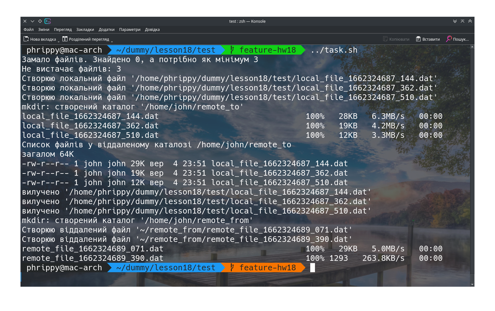
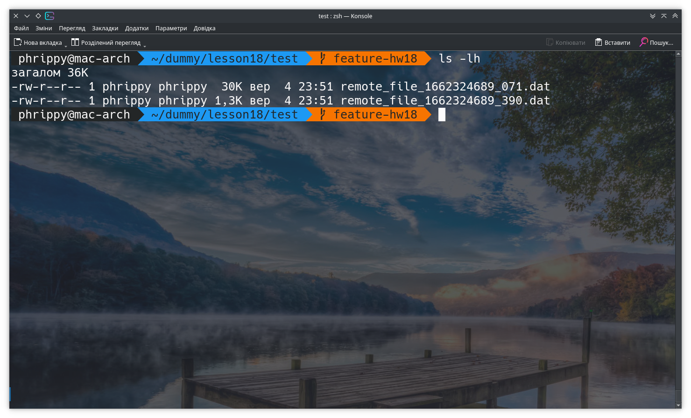
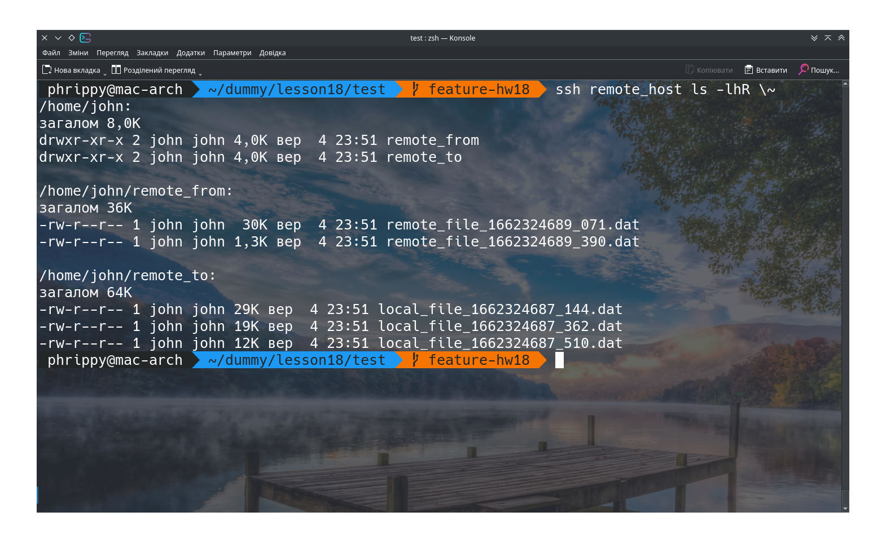

Спочатку створимо окремий файл, в якому зберігатимемо окремі функції для виконання завдання. Так основний скрипт виглядатиме естетичніше. Збережемо його в файлі `lib.sh`:

```bash
declare -xa FILES_TO_COPY=()
declare -xa FILES_FROM_COPY=()

check_remote_dir(){
cat <<EOF | ssh ${REMOTE_HOST} bash
	if [ ! -e $1 ] ; then
		mkdir -pv $1
	else
		if [ ! -d $1 ] ; then
			echo "Віддалений об'єкт $1 не є каталогом. Завершення роботи" >&2
			exit 1
		fi
	fi
EOF
}

get_local_files(){
	FILES_TO_COPY=()
	while IFS= read -r -d $'\0' ; do
		FILES_TO_COPY+=("${REPLY}")
	done < <(find "${DIRECTORY}"/* -maxdepth 0 -type f -print0 2> /dev/null)
}

list_remote_files(){
	echo -n "Список файлів у віддаленому каталозі "
	ssh ${REMOTE_HOST} "echo ${REMOTE_DIRECTORY_TO} ; ls -lh ${REMOTE_DIRECTORY_TO}"
}

rm_local_files(){
	# Видаляємо за допомогою xargs
	printf "%s\n" "${FILES_TO_COPY[@]}" | xargs rm -v
}

get_remote_files(){
	FILES_FROM_COPY=()
	while IFS= read -r -d $'\0' ; do
		FILES_FROM_COPY+=("${REPLY}")
	done < <(ssh "${REMOTE_HOST}" find "${REMOTE_DIRECTORY_FROM}"/* -maxdepth 0 -type f -print0 2> /dev/null)
}

copy_from_remotedir(){
	printf "${REMOTE_HOST}:%s\n" "${FILES_FROM_COPY[@]}" | xargs -I {} scp "{}" "${DIRECTORY}"
}

copy_to_remotedir() {
	FILES_COUNT="${#FILES_TO_COPY[@]}"
	if [ ${FILES_COUNT} -le $MIN_FILES_TO ] ; then
		echo "Замало файлів. Знайдено ${FILES_COUNT}, а потрібно як мінімум ${MIN_FILES_TO}" >&2
		NEEDED_FILES=$((MIN_FILES_TO - FILES_COUNT))
		echo "Не вистачає файлів: ${NEEDED_FILES}"
		makefiles_local ${NEEDED_FILES}
		get_local_files
	fi
	check_remote_dir $REMOTE_DIRECTORY_TO || exit $?
	for i in "${FILES_TO_COPY[@]}" ; do
		scp "$i" ${REMOTE_HOST}:"${REMOTE_DIRECTORY_TO}"
	done
}

makefiles_local(){
	DEFAULT_FILES=3
	COUNTER="${1-${DEFAULT_FILES}}"
	for i in $(seq 1 ${COUNTER})
	 do
		 FILENAME="$DIRECTORY/local_file_$(date +%s_%3N).dat"
		 echo "Створюю локальний файл '${FILENAME}'"
		 dd if=/dev/urandom of="$FILENAME" bs=1 count=$RANDOM 2> /dev/null
	done
}

makefiles_remote(){
	check_remote_dir $REMOTE_DIRECTORY_FROM || exit $?
	DEFAULT_FILES=2
	COUNTER="${1-${DEFAULT_FILES}}"
	FILES_FROM_COPY=()
	for i in $(seq 1 ${COUNTER}) ; do
		FILENAME="$REMOTE_DIRECTORY_FROM/remote_file_$(date +%s_%3N).dat"
		echo "Створюю віддалений файл '${FILENAME}'"
		FILES_FROM_COPY+=("${FILENAME}")
		ssh "${REMOTE_HOST}" dd if=/dev/urandom of="$FILENAME" bs=1 count=$RANDOM 2> /dev/null
	done
}
```

Претекст

```bash
#!/bin/bash
SCRIPT_DIR="$(dirname $(realpath $0))"

# Директорія для роботи з файлами
export DIRECTORY="${PWD}"

# Віддалений хост. Можна використовувати:
# хост із ~/.ssh/config
# ip-адресу
# хост із /etc/hosts
# DNS-ім'я
export REMOTE_HOST='remote_host'

# Директорії на віддаленому хості

# Для копіювання файлів на віддалений хост
export REMOTE_DIRECTORY_TO='~/remote_to'
# Для копіювання файлів з віддаленого хосту
export REMOTE_DIRECTORY_FROM='~/remote_from'

# Мінімум файлів для копіювання на віддалений хост
# Якщо файлів в робочому каталозі не вистачатиме, створяться додаткові файли
export MIN_FILES_TO=3

# Кількість файлів для створення на віддаленому хості
export COUNT_FILES_FROM=2

# Завантажимо необхідний набір функцій із файлу lib.sh
source "${SCRIPT_DIR}/lib.sh"

# Якщо скрипт знаходиться в поточному каталозі, створимо поруч новий каталог і зробимо його основним
# Інакше працюватимемо із пототочним каталогом
if [ $SCRIPT_DIR == $DIRECTORY ] ; then
	DIRECTORY="$DIRECTORY/workdir_$(date +%s_%3N)"
	mkdir -v "$DIRECTORY"
fi

# Дістаємо список файлів із поточного каталогу
get_local_files

# Копіюємо файли з поточного каталогу на віддалений хост
copy_to_remotedir

# Відображаємо лістинг файлів у віддаленому каталозі
list_remote_files

# Видаляємо локально скопійовані на віддалений хост файли
rm_local_files

# Створюємо на віддаленому хості потрібну кількість файлів
makefiles_remote ${COUNT_FILES_FROM}

# Копіюємо новостворені файли на локальний хост
copy_from_remotedir
```

* Я старався мінімально подавлювати стандартний вивід скрипта. Після запуску отримуємо такі дані:



* Робоча директорія має такий вигляд. Як бачимо, залишились лише файли, скопійовані з віддаленого хосту



* На віддаленому хості було спеціально створено нового користувача з іншим іменем. Тому можна просто переглянути вміст домашнього каталогу, без опції `-a`:


