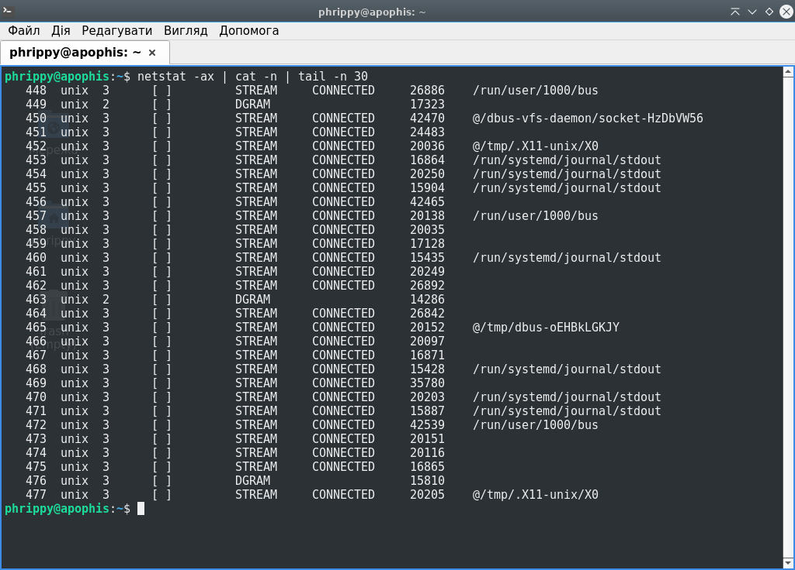
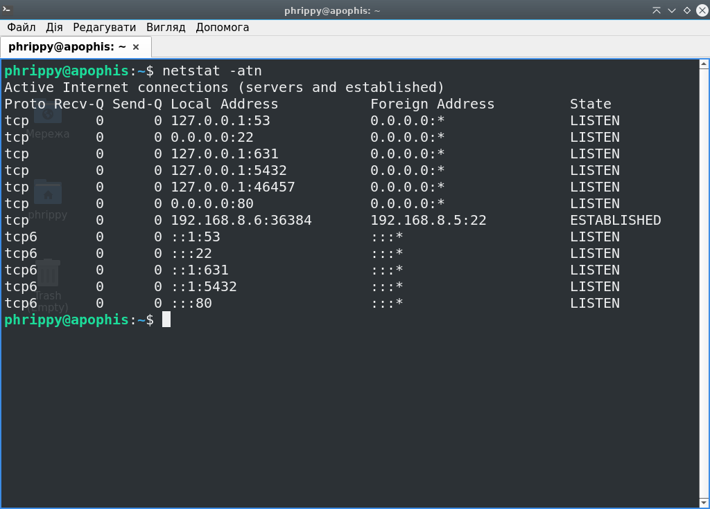
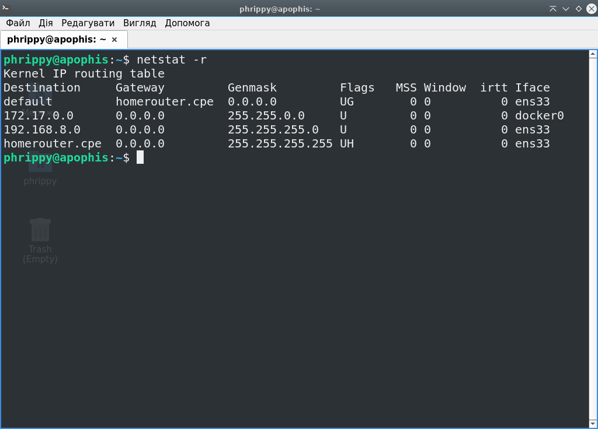
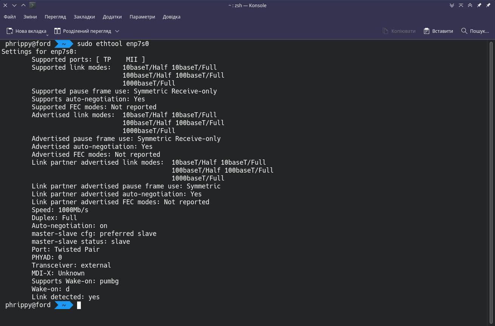
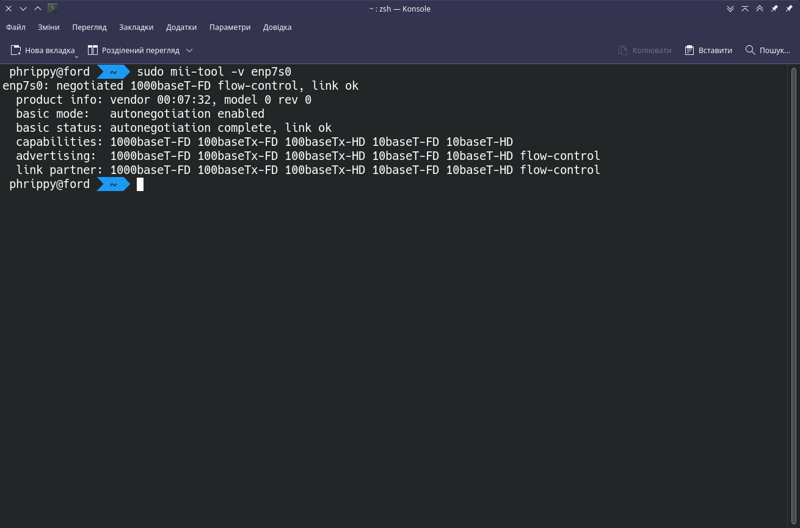
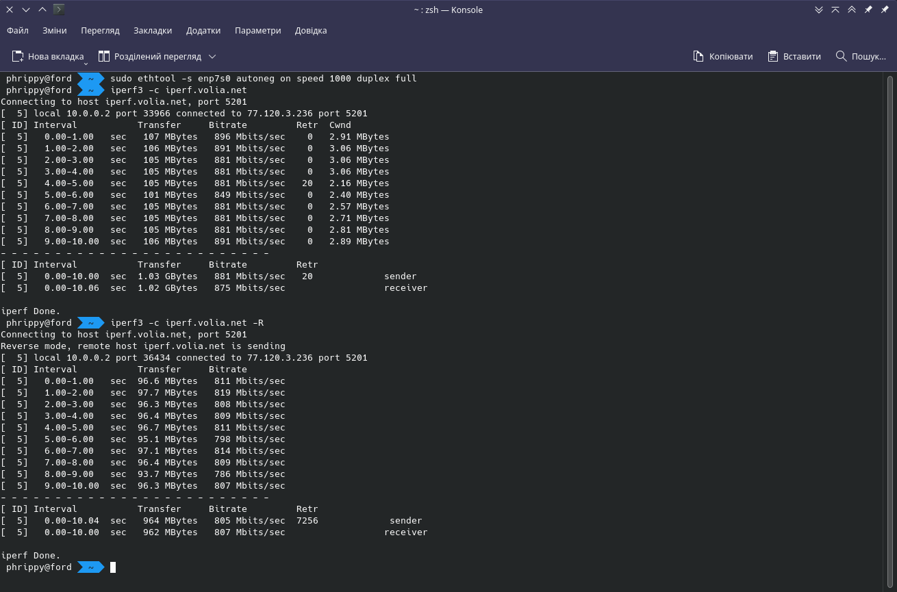
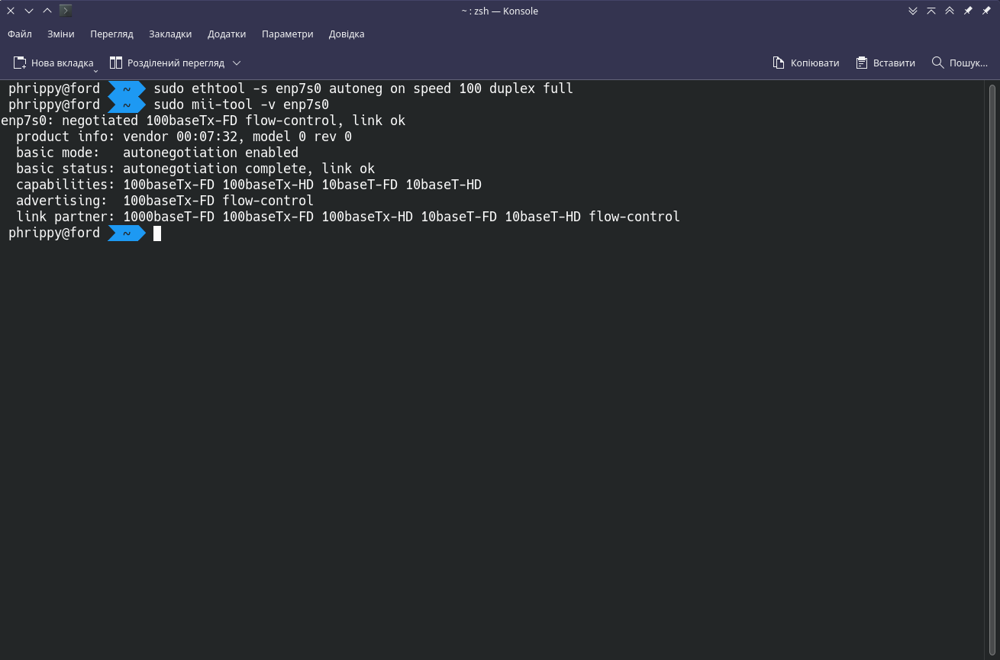

при помощи утилиты nestat проверить

1. юникс сокеты и их состояние `netstat -lx`
2. tcp сокеты и их сотояние `netstat -ltn`
3. таблицу маршрутизации `netstat -r`
 (подобную проверку хорошо делать на системе, в котрой есть либо веб сервер либо веб клиент - браузер. обратите внимание на состояния сокетов FIN WAIT)
 
* (установить) ethtool & mii-tool в систему. 
* проверить одним (или, если работает, двумя) инструментом настройки скорости передачи и режим дуплекс/полудуплекс.
* найти инструмент для проверки пропускной способности сети.
* проверить скорости приема/передачи для дефолтных настроек сетевой карты и для варианта "скорость карты ниже на предыдущий шаг " (например стандарт 1ГБпс - перевести сетевую карту в режим 100Мбпс) и сделать измерения в полу и полнодуплексном режимах. (должно получиться три измерения скорости - номинальный, уменьшенная скорость полный дуплекс и полудуплекс).

Список всіх unix-сокетів можна дістати командою `netstat -ax`:

Список всіх tcp-сокетів - командою `netstat -atn`. Ключ `-n` потрібен для показу ip-адрес замість імен:

Таблиця маршрутизації доступна по команді `netstat -r`:

Оскільки наступні маніпуляції ігноруються гіпервізором, будемо використовувати реальну машину

# Налаштування мережі за замовчуванням:

* ethtool

* mii-tool

 
* Тест швидкості за допомогою `ipref`

# Налаштування мережі після встановлення швидкості 100MBit, Full Duplex:

* ethtool

* mii-tool

 
* Тест швидкості за допомогою `ipref`

