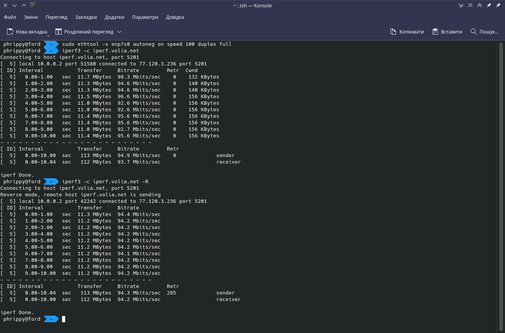

Список всіх unix-сокетів можна дістати командою `netstat -ax`:

Список всіх tcp-сокетів - командою `netstat -atn`. Ключ `-n` потрібен для показу ip-адрес замість імен:

Таблиця маршрутизації доступна по команді `netstat -r`:

Оскільки наступні маніпуляції ігноруються гіпервізором, будемо використовувати реальну машину

# Налаштування мережі за замовчуванням:

* ethtool

* mii-tool

 
* Тест швидкості за допомогою `iperf`

# Налаштування мережі після встановлення швидкості 100MBit, Full Duplex:

* ethtool

* mii-tool

 
* Тест швидкості за допомогою `iperf`

# Налаштування мережі після встановлення швидкості 100MBit, Half Duplex:

* ethtool

* mii-tool

 
* Тест швидкості за допомогою `iperf`

Схоже, в режимі half duplex 100MBit мережа почувається не дуже добре в режимі download. Це ж підтверджує і `speedtest-cli`:

Загалом, висновок такий: краще за все використовувати режим Full Duplex і максимальну швидкість мережевого адаптеру, якщо тільки ситуація не потребує особливого втручання
