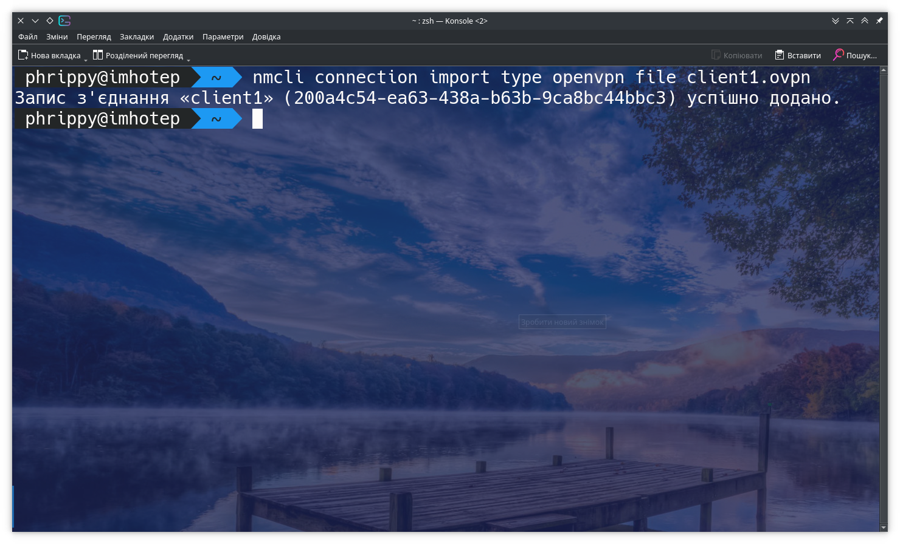
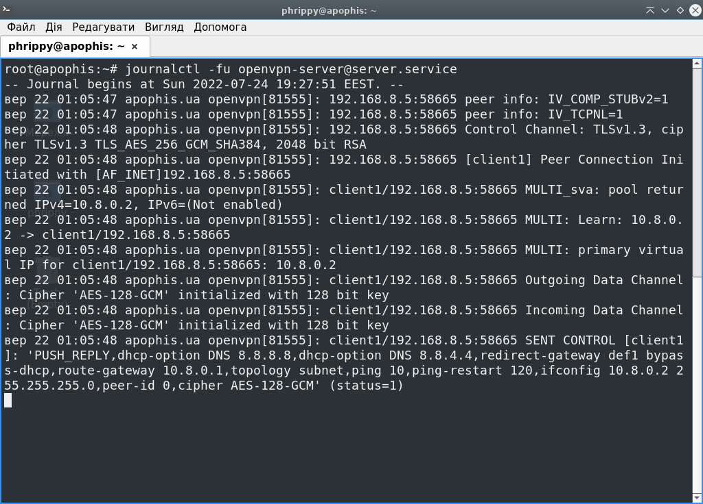
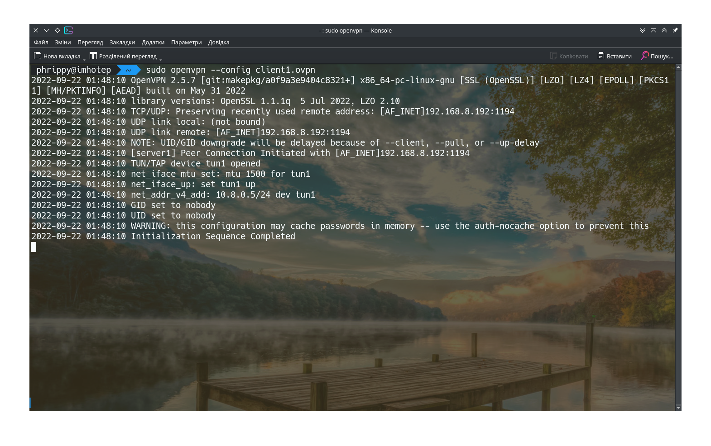

Брандмауер і NAT налаштовано, тепер можна увімкнути наш сервер. Для цього запустимо команду:

```
sudo systemctl start openvpn-server@server.service
```
Тут варто наголосити про деяку магію systemd. `openvpn-server` - це назва systemd-юніту. А от `server`, що після символу @ - це назва конфігураційного файлу `server.conf`. Завдяки такій структурі, ми можемо створити будь-яку кількість конфігураційних файлів в каталозі `/etc/openvpn/server/` і незалежно їх запускати командами на кшталт `sudo systemctl start openvpn-server@another_server.service`. Звісно ж, як мінімум, конфігурації повинні відрізнятися портами, які слухає сервер


Тепер перейдемо на клієнт. Попередньо нам потрібно встановити деякі базові пакети:


Тепер, маючи файл client1.ovpn, OpenVPN-клієнт і плагін для NetworkManager, ми можемо додати нове з'єднання, запустивши команду `nmcli connection import type openvpn file client1.ovpn`:



Як бачимо, нове з'єднання успішно створено. Це підтверджує і інтерфейс операційної системи. Як бачимо, плагін для NetworkManager успішно обробив наш файл і автоматично здійснив за нас відповідні налаштування:


Було створено новий мережевий інтерфейс tun0 і присвоєно нам ip-адресу 10.8.0.2


Цю ж інформацію підтверджує і сервер, якщо запустити команду `sudo journalctl -fu  openvpn-server@server.service`



Якщо маємо на клієнті голу консоль, можемо скористатись наступним синтаксисом:

```bash
openvpn --config client1.ovpn
```

Це запустить клієнт в консолі, з тим же самим результатом, але без інтеграції з NetworkManager. Можна цю команду обернути в systemd-юніт, попутно додавши до неї автозапуск, перезапуск при збоях і збереження логів, які зараз пишуться в stdout. Але це не тема завдання, тому опустимо такий функціонал.



Передамо наш конфігураційний файл на android-смартфон і запустимо його через відповідний додаток:


Ну і, власне, останній скріншот. Як бачимо, є доступ до інтернету і доступ до інших клієнтів:


