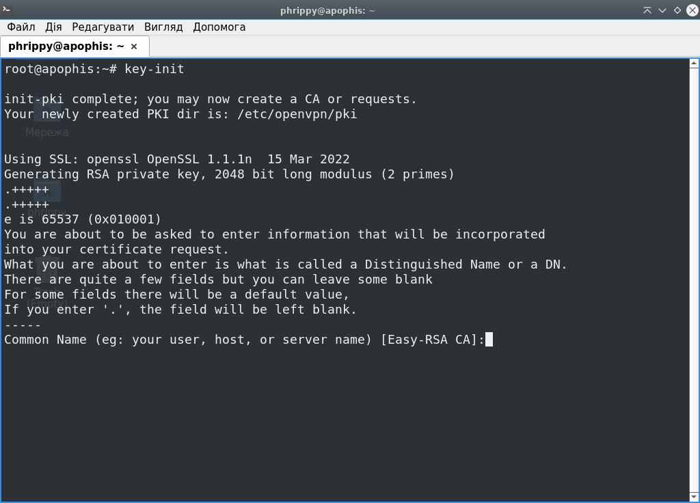
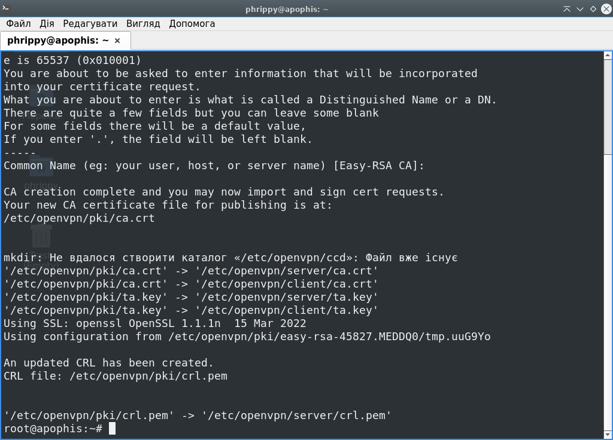
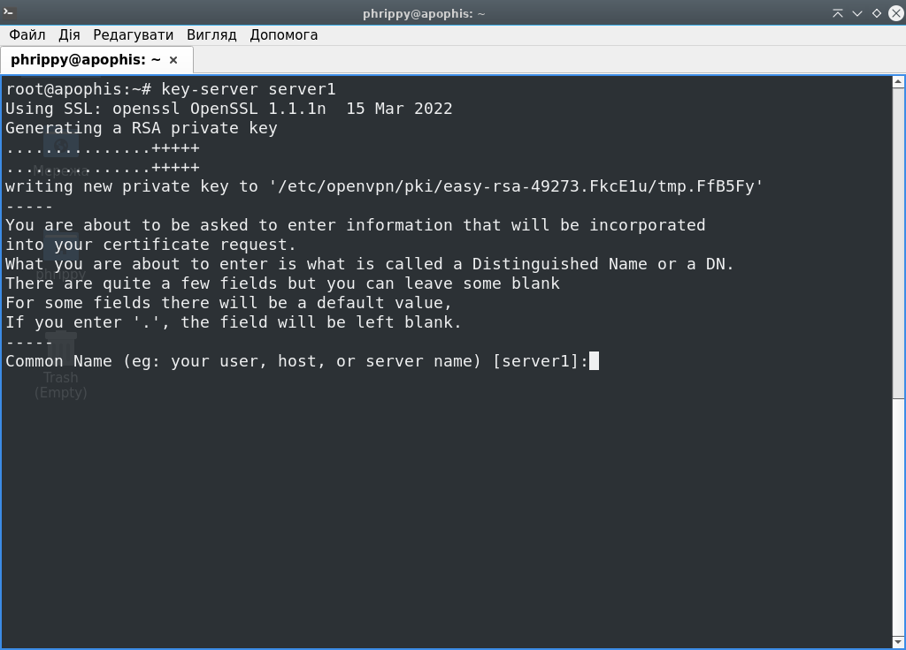

## Тепер імпортуємо всі змінні і функції із новоствореного скрипта:

```bash
source ./keygen.sh
```

## Після цього ініціалізуємо середовище:

```bash
key-init
```



Назву центра сертифікації можна залишити за замовчуванням, просто натискаємо Enter



*Середовище для інфраструктури відкритих ключів успішно створене*

## Створимо ключі і сертифікати для сервера:

```bash
key-server server1
```

Ім'я сервера залишаємо за замовчуванням, просто натискаємо Enter



Підтверджуємо підпис ключа для openvpn-сервера. Вводимо `yes` і натискаємо Enter


Ключ для openvpn-сервера успішно створено і підписано центром сертифікації:


## Створимо ключі і сертифікати для клієнта:

```bash
key-client client1
```


## Тепер прийшла пора створити файл конфігурації. Заповнимо його наступним чином:
