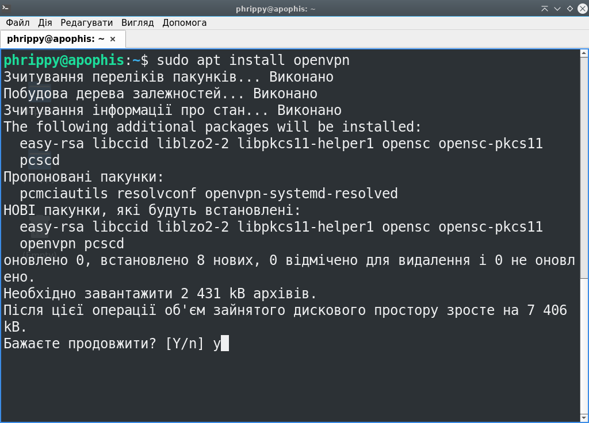
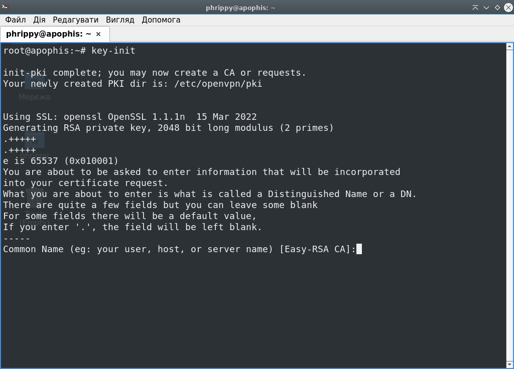
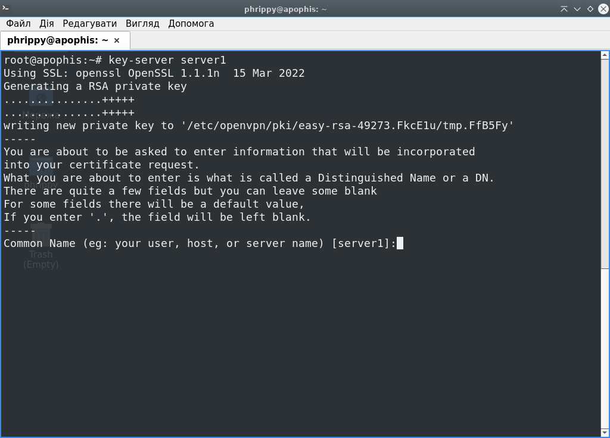
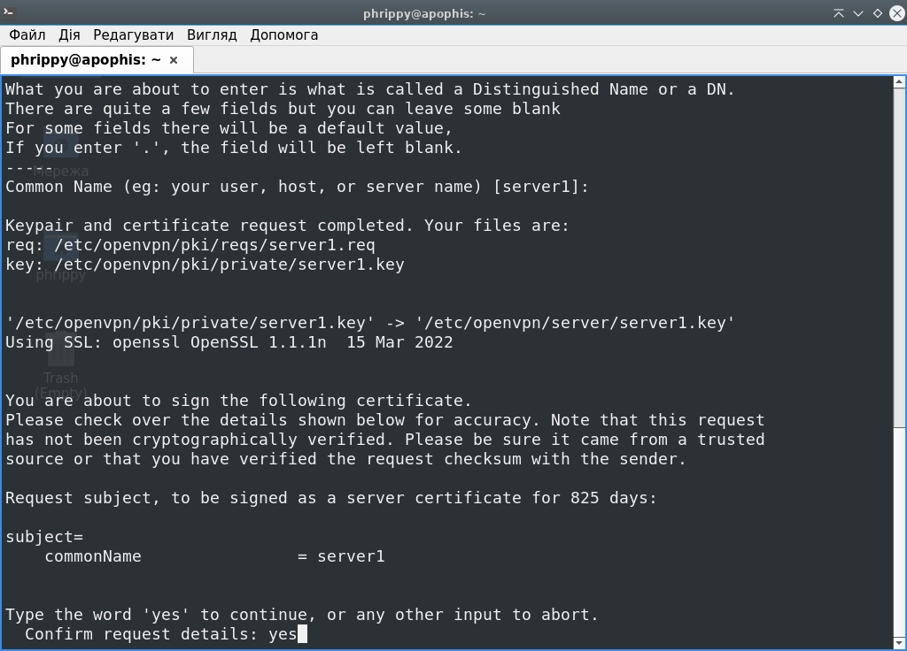
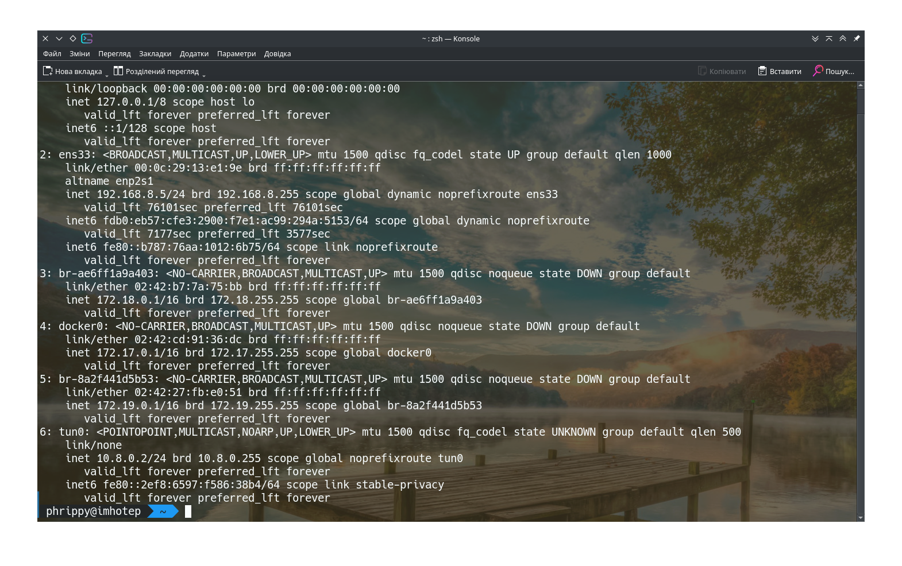

# Встановлюємо необхідні пакети:

```bash
sudo apt update
sudo apt install openvpn
```


# Генеруємо необхідний набір ключів

Для цього напишемо простенький скрипт:

```bash
#!/bin/bash
PKI_DIR=/etc/openvpn/pki
EASYRSA=/usr/share/easy-rsa/easyrsa
COMMAND="${EASYRSA} --pki-dir=${PKI_DIR}"
SERVER_DIR=/etc/openvpn/server
CLIENT_DIR=/etc/openvpn/client

# Функція створює PKI (Public Key Infrastructure) - інфраструктуру відкритих ключів
# Потім створює кореневий сертифікат і копіює його в директорії сервера і клієнта
# Для простоти центр сертифікації буде на тій же машині, що і сервер openvpn
key-init(){
  $COMMAND init-pki
  $COMMAND build-ca nopass
	mkdir /etc/openvpn/ccd	
  cp -v $PKI_DIR/ca.crt $SERVER_DIR
  cp -v $PKI_DIR/ca.crt $CLIENT_DIR
  openvpn --genkey secret ${PKI_DIR}/ta.key
  cp -v $PKI_DIR/ta.key $SERVER_DIR
  cp -v $PKI_DIR/ta.key $CLIENT_DIR
  $COMMAND gen-crl
  cp -v ${PKI_DIR}/crl.pem $SERVER_DIR
}

# Створення і копіювання в потрібні директорії ключа і сертифіката для серверу
key-server(){
  name=${1-server1}
  $COMMAND gen-req ${name} nopass
  cp -v ${PKI_DIR}/private/${name}.key $SERVER_DIR
  $COMMAND sign-req server ${name} 
  cp -v ${PKI_DIR}/issued/${name}.crt $SERVER_DIR
}

# Створення і копіювання в потрібні директорії ключа і сертифіката для клієнту
# Потрібно генерувати окремий ключ для кожного клієнту,
# бо openvpn генерує однакові ip-адреси для однакових ключів
# Щоб це обійти, потрібно додати рядок duplicate-cn в файл конфігурації серверу
key-client(){
  name=${1-client1}
  $COMMAND gen-req ${name} nopass
  cp -v ${PKI_DIR}/private/${name}.key $CLIENT_DIR
  $COMMAND sign-req client ${name} 
  cp -v ${PKI_DIR}/issued/${name}.crt $CLIENT_DIR
}
```

## Тепер імпортуємо всі змінні і функції із новоствореного скрипта:

```bash
source ./keygen.sh
```

## Після цього ініціалізуємо середовище:

```bash
key-init
```



Назву центра сертифікації можна залишити за замовчуванням, просто натискаємо Enter


*Середовище для інфраструктури відкритих ключів успішно створене*

## Створимо ключі і сертифікати для сервера:

```bash
key-server server1
```

Ім'я сервера залишаємо за замовчуванням, просто натискаємо Enter



Підтверджуємо підпис ключа для openvpn-сервера. Вводимо `yes` і натискаємо Enter



Ключ для openvpn-сервера успішно створено і підписано центром сертифікації:


## Створимо ключі і сертифікати для клієнта:

```bash
key-client client1
```

Ім'я клієнта залишаємо за замовчуванням, просто натискаємо Enter


Підтверджуємо підпис ключа для openvpn-клієнта. Вводимо `yes` і натискаємо Enter


Ключ для openvpn-клієнта успішно створено і підписано центром сертифікації:


## Тепер прийшла пора створити файл конфігурації для сервера. Заповнимо його наступним чином:

```bash
port 1194
proto udp
dev tun
user nobody
# Варто звернути увагу: в залежності від дистрибутиву, група може називатись або nogroup, або nobody
# group nobody
group nogroup
persist-key
persist-tun
keepalive 10 120
topology subnet
# Діапазон ip-адрес, які отримуватимуть клієнти
server 10.8.0.0 255.255.255.0
ifconfig-pool-persist ipp.txt
push "dhcp-option DNS 8.8.8.8"
push "dhcp-option DNS 8.8.4.4"
push "redirect-gateway def1 bypass-dhcp"
dh none
ecdh-curve prime256v1
# Тут вписуємо абсолютні шляхи до раніше згенерованих ключів і сертифікатів
tls-crypt /etc/openvpn/server/ta.key
crl-verify /etc/openvpn/server/crl.pem
ca /etc/openvpn/server/ca.crt
cert /etc/openvpn/server/server1.crt
key /etc/openvpn/server/server1.key
auth SHA256
cipher AES-128-GCM
ncp-ciphers AES-128-GCM
tls-server
tls-version-min 1.2
tls-cipher TLS-ECDHE-ECDSA-WITH-AES-128-GCM-SHA256
client-config-dir /etc/openvpn/ccd
status /var/log/openvpn/status.log
# Рівень логування
verb 3
# Видаємо різні ip-адреси для клієнтів, що зайшли під одним ключем.
# Для лабораторного середовища так зручніше, але в реальних умовах було б правильніше генерувати окремий ключ для кожного клієнта
duplicate-cn
```

## Створюємо файл конфігурації для клієнта

Взагалі-то цей файл не є обов'язковим, але без нього на десктопних клієнтах доведеться вводити всі параметри з'єднання вручну. А на мобільних клієнта без нього взагалі не обійтись

```bash
client
dev tun
proto udp
# DNS-ім'я сервера і порт.
# Для лабораторного проекту можна скористатися функціоналом файлу /etc/hosts
# В ідеалі було б непогано підняти DNS-сервер на спеціальній машині
remote apophis 1194
resolv-retry infinite
nobind
user nobody
group nobody
persist-key
persist-tun
remote-cert-tls server
cipher AES-128-GCM
verb 1
```

Після виконання `key-client client1` ми маємо наступний набір файлів в директорії `/etc/openvpn/client/`:

* ca.crt
* client1.crt
* client1.key
* ta.key
* client.conf

Можна передати ці файли клієнту - хай вручну налаштовує VPN-з'єднання через відповідні діалоги операційної системи. Я пробував, це працює, але це довго і незручно. Краще згенеруємо один \*.ovpn файл і передамо його клієнту. Такий формат розуміють клієнти на всіх платформах. Потрібно зібрати вміст файлів в один. Для цього створимо наступний скрипт в каталозі з файлами для клієнта:

```bash
#!/bin/bash
name=${1-client1}
(
cat client.conf
echo '<ca>'
cat ca.crt
echo '</ca>'
echo '<cert>'
cat ${name}.crt
echo '</cert>'
echo '<key>'
cat ${name}.key
echo '</key>'
echo '<tls-crypt>'
cat ta.key
echo '</tls-crypt>'
)> ${name}.ovpn
```

Запустимо новостворений скрипт:


Ми отримали файл `client1.ovpn`, який можна передавати клієнтам. Завдяки опції `duplicate-cn` в конфігурації сервера можна використовувати один такий файл для багатьох клієнтів. Якщо політика безпеки вимагає різні доступи для клієнтів, тоді опцію потрібно вимкнути і генерувати файли \*.ovpn окремо для кожного клієнта

Але перед цим вже варто було б увімкнути наш сервер. Для цього запустимо команду:

```
sudo systemctl start openvpn-server@server.service
```
Тут варто наголосити про деяку магію systemd. `openvpn-server` - це назва systemd-юніту. А от `server`, що після символу @ - це назва конфігураційного файлу `server.conf`. Завдяки такій структурі, ми можемо створити будь-яку кількість конфігураційних файлів в каталозі `/etc/openvpn/server/` і незалежно їх запускати командами на кшталт `sudo systemctl start openvpn-server@another_server.service`. Звісно ж, як мінімум, конфігурації повинні відрізнятися портами, які слухає сервер


Тепер перейдемо на клієнт. Попередньо нам потрібно встановити деякі базові пакети:


Тепер, маючи файл client1.ovpn, OpenVPN-клієнт і плагін для NetworkManager, ми можемо додати нове з'єднання, запустивши команду `nmcli connection import type openvpn file client1.ovpn`:


Як бачимо, нове з'єднання успішно створено. Це підтверджує і інтерфейс операційної системи. Як бачимо, плагін для NetworkManager успішно обробив наш файл і автоматично здійснив за нас відповідні налаштування:


Було створено новий мережевий інтерфейс tun0 і присвоєно нам ip-адресу 10.8.0.2



Цю ж інформацію підтверджує і сервер, якщо запустити команду `sudo journalctl -fu  openvpn-server@server.service`


Якщо маємо на клієнті голу консоль, можемо скористатись наступним синтаксисом:

```bash
openvpn --config client1.ovpn
```

Це запустить клієнт в консолі, з тим же самим результатом, але без інтеграції з NetworkManager. Можна цю команду обернути в systemd-юніт, попутно додавши до неї автозапуск, перезапуск при збоях і збереження логів, які зараз пишуться в stdout. Але це не тема завдання, тому опустимо такий функціонал.


