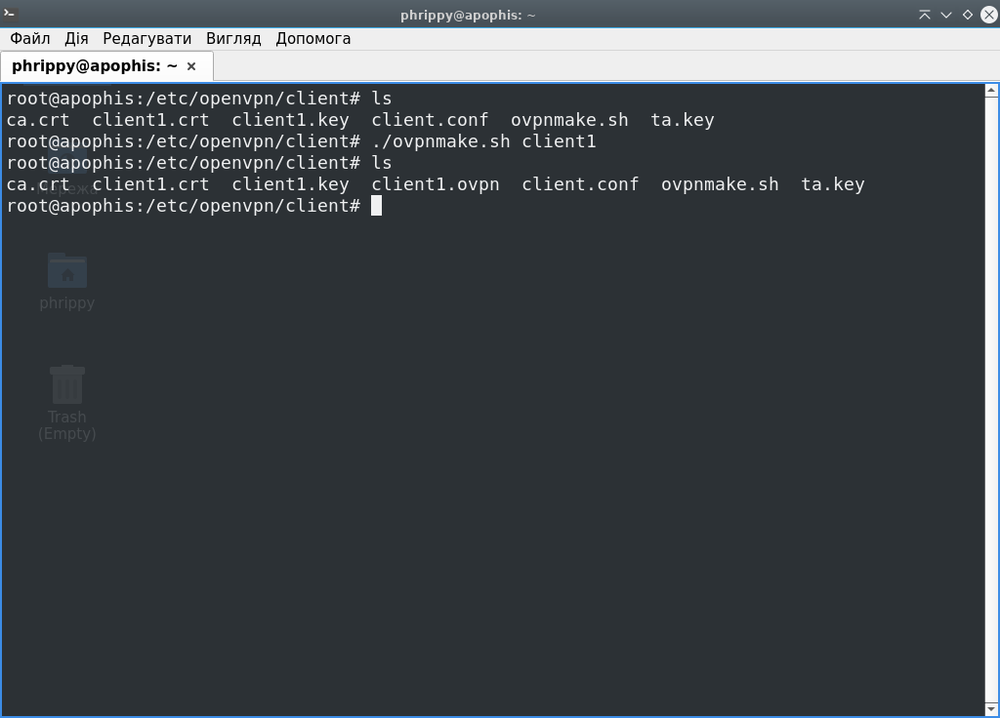

Запустимо новостворений скрипт:

Ми отримали файл `client1.ovpn`, який можна передавати клієнтам. Завдяки опції `duplicate-cn` в конфігурації сервера можна використовувати один такий файл для багатьох клієнтів. Якщо політика безпеки вимагає різні доступи для клієнтів, тоді опцію потрібно вимкнути і генерувати файли \*.ovpn окремо для кожного клієнта

Тепер потрібно налаштувати брандмауер - відкрити потрібні порти і увімкнути NAT:
