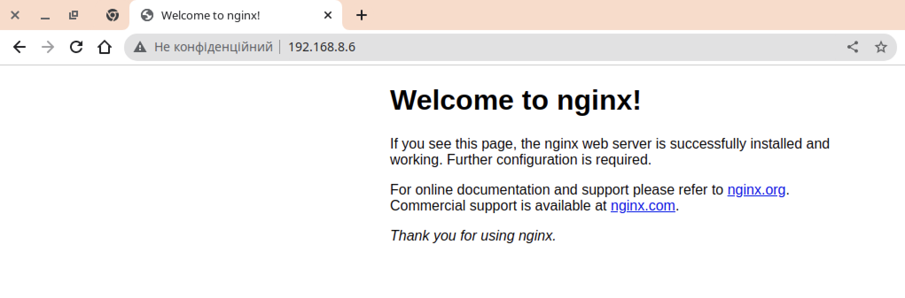

# Збираємо образ

Для збирання образу запустимо в каталозі з усіма необхідними файлами команду

```bash
docker build -t phrippy/nginx-custom:latest .
```

В даному випадку:
* `phrippy` - ім'я користувача
* `nginx-custom` - ім'я образу
* `latest` - тег (семантично це те ж саме, що і версія)
* `.` - місцезнаходження Dockerfile для збирання образу, крапка означає поточний каталог


# Завантажуємо образ на dockerhub

Перед безпосереднім завантаженням образу на dockerhub потрібно спочатку зареєструватись на сайті hub.docker.com і увійти у відповідний обліковий запис командою `docker login`. Завантажуємо образ командою:

```bash
docker push phrippy/nginx-custom
```


Як бачимо, завантаження пройшло успішно. Щоб додатково в цьому впевнитись, можна переглянути список репозиторіїв за url `hub.docker.com/repositories`:


# Видаляємо створений локально образ

Для видалення скористаємось командою:

```bash
docker rmi phrippy/nginx-custom
```

Як бачимо, новостворений образ був видалений і зник зі списку доступних образів:


# Запускаємо контейнер на базі створеного образу

Запускаємо команду:

```bash
docker run -d --rm -p80:80 --name mynginx phrippy/nginx-custom
```
* `-d` запустить контейнер в режимі демона і віддасть нам консоль. Для лабораторних експериментів не обов'язково
* `--rm` видалить контейнер після завершення його роботи
* `-p80:80` перенаправить всі запити на 80 порт локального хосту до 80 порту контейнеру. Директиви EXPOSE в Dockerfile недостатньо - вона лише відкриває порт в мережі docker
* `--name mynginx` задає ім'я для контейнеру. Якщо його не задати, то docker згенерує ім'я сам


Варто звернути увагу на декілька рядків виводу команди `docker run`:
* `Unable to find image 'phrippy/nginx-custom:latest' locally` означає, що docker не зміг знайти потрібний образ локально. Логічно, ми ж його перед цим видалили командою `docker rmi`
* `latest: Pulling from phrippy/nginx-custom` означає завантаження образу із docker registry. Тобто ми тепер не прив'язані до конкретної машини і можемо завантажити наш образ будь-куди однією і тією ж командою
* `40c478886090d465ee8fa1297e0afdf1e02a5968573fd17f026bbcfdcef8195b` - це так званий ідентифікатор запущеного контейнеру. Його ж (тобто перші символи) видно у виводі команди `docker ps`

# Перевіряємо доступність статичної сторінки з хоста

Для швидкої перевірки скористаємось curl:

```bash
curl -s 127.0.0.1:80 | elinks | cat
```


Також доступ до контейнеру можна отримати і з іншого хосту:



Звісно ж, якщо для хосту, де запущений контейнер, є DNS-запис, доступ можна отримати і через нього:


