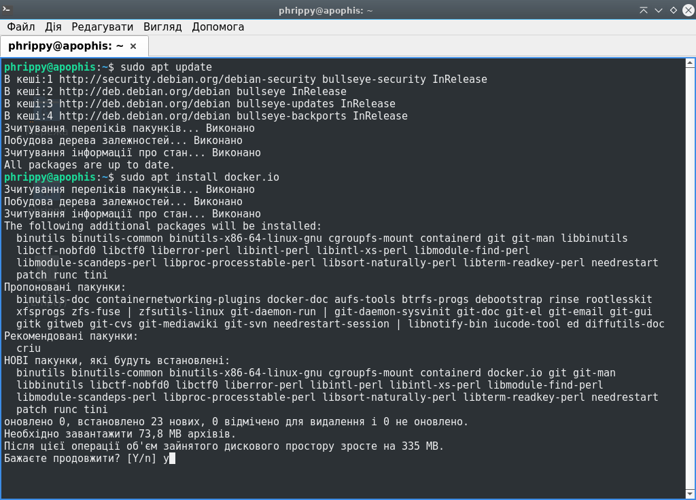
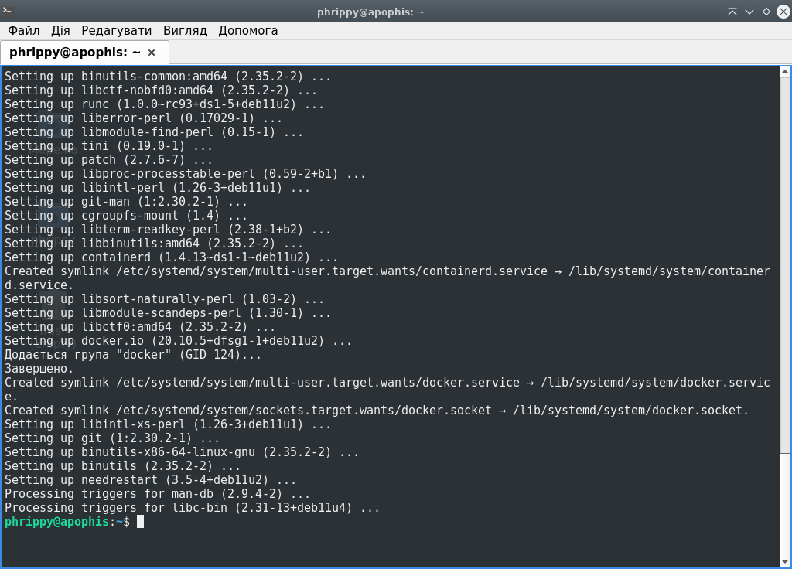

1. установить доккер (виртуальная машина. более сложный вариант - в контейнере)
2. создать Dockerfile (желательно на базе alpine) который установит в контейнер nginx и скопирует статическую html страницу.
3. протегировать образ в формате: проект/номер_сборки и загрузить его на доккер хаб.
4. удалить локально созданный образ.
5. запустить контейнер на базе созданного образа. проверить доступность статической страницы с хоста.

# Встановлюємо Docker:

```bash
sudo apt install docker.io
```



Docker успішно встановлено



# Dockerfile

Інструкція для docker буде розміщуватися в файлі `Dockerfile` і виглядатиме так:

```Dockerfile
FROM alpine:latest
RUN apk add --no-cache nginx
COPY nginx.conf /etc/nginx/
COPY index.html /usr/share/nginx/html/
ENTRYPOINT ["nginx"]
```

# Файл конфігурації

Файл буде знаходитись в контейтері за адресою  `/etc/nginx/nginx.conf` і матиме наступний вміст:

```Nginx config
user  nginx;
worker_processes  auto;
daemon off;
error_log  /dev/stdout notice;
pid        /var/run/nginx.pid;
events {
    worker_connections  1024;
}
http {
    include       /etc/nginx/mime.types;
    default_type  application/octet-stream;
    log_format  main  '$remote_addr - $remote_user [$time_local] "$request" '
                      '$status $body_bytes_sent "$http_referer" '
                      '"$http_user_agent" "$http_x_forwarded_for"';
    access_log         /dev/stdout  main;
    sendfile           on;
    keepalive_timeout  65;
    server {
        listen       80;
        location / {
            root   /usr/share/nginx/html;
            index  index.html index.htm;
        }
    }
}
```

# Статична html-сторінка

Для html-сторінки використаємо файл із стандартної поставки nginx (якого, тим не менше, немає у варіанті від alpine linux). Відповідно з конфігурацією, розмістимо його за адресою `/usr/share/nginx/html/index.html`:

```html
<!DOCTYPE html>
<html>
<head>
<title>Welcome to nginx!</title>
<style>
html { color-scheme: light dark; }
body { width: 35em; margin: 0 auto;
font-family: Tahoma, Verdana, Arial, sans-serif; }
</style>
</head>
<body>
<h1>Welcome to nginx!</h1>
<p>If you see this page, the nginx web server is successfully installed and
working. Further configuration is required.</p>

<p>For online documentation and support please refer to
<a href="http://nginx.org/">nginx.org</a>.<br/>
Commercial support is available at
<a href="http://nginx.com/">nginx.com</a>.</p>

<p><em>Thank you for using nginx.</em></p>
</body>
</html>
```

# Тегуємо образ

# Завантажуємо на Dockerhub

# Видаляємо створений локально образ

# Запускаємо контейнер на базі створеного образу
# Перевіряємо доступність статичної сторінки з хоста
