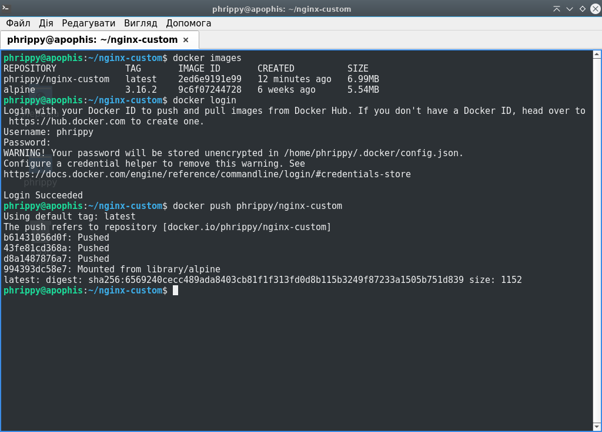
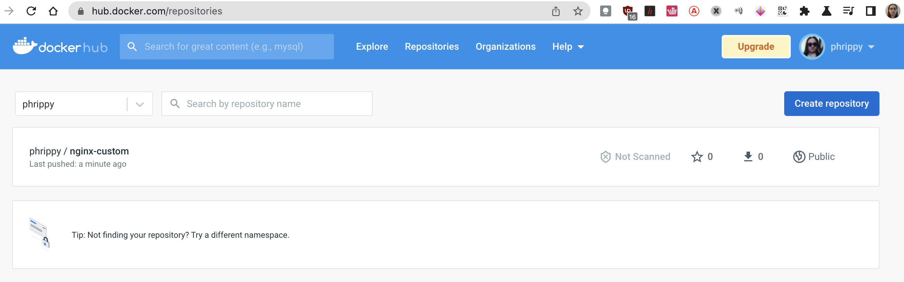
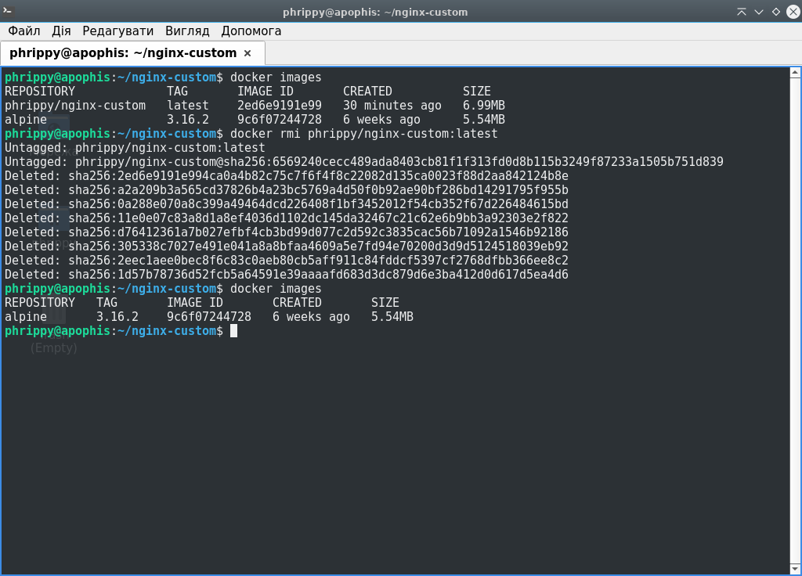

# Встановлюємо Docker:

```bash
sudo apt install docker.io
```


Docker успішно встановлено


# Dockerfile

Інструкція для docker буде розміщуватися в файлі `Dockerfile` і виглядатиме так:

```Dockerfile
FROM alpine:3.16.2
MAINTAINER Serhii Hordiienko <phrippy2@gmail.com>
RUN apk add --no-cache --repository https://dl-cdn.alpinelinux.org/alpine/v3.16/main nginx=1.22.0-r1
COPY nginx.conf /etc/nginx/
COPY index.html /usr/share/nginx/html/
CMD ["nginx"]
```

# Файл конфігурації

Файл буде знаходитись в контейтері за адресою  `/etc/nginx/nginx.conf` і матиме наступний вміст:

```Nginx config
user  nginx;
worker_processes  auto;
daemon off;
error_log  /dev/stdout notice;
pid        /var/run/nginx.pid;
events {
    worker_connections  1024;
}
http {
    include       /etc/nginx/mime.types;
    default_type  application/octet-stream;
    log_format  main  '$remote_addr - $remote_user [$time_local] "$request" '
                      '$status $body_bytes_sent "$http_referer" '
                      '"$http_user_agent" "$http_x_forwarded_for"';
    access_log         /dev/stdout  main;
    sendfile           on;
    keepalive_timeout  65;
    server {
        listen       80;
        location / {
            root   /usr/share/nginx/html;
            index  index.html index.htm;
        }
    }
}
```

# Статична html-сторінка

Для html-сторінки використаємо файл із стандартної поставки nginx (якого, тим не менше, немає у варіанті від alpine linux). Відповідно з конфігурацією, розмістимо його за адресою `/usr/share/nginx/html/index.html`:

```html
<!DOCTYPE html>
<html>
<head>
<title>Welcome to nginx!</title>
<style>
html { color-scheme: light dark; }
body { width: 35em; margin: 0 auto;
font-family: Tahoma, Verdana, Arial, sans-serif; }
</style>
</head>
<body>
<h1>Welcome to nginx!</h1>
<p>If you see this page, the nginx web server is successfully installed and
working. Further configuration is required.</p>

<p>For online documentation and support please refer to
<a href="http://nginx.org/">nginx.org</a>.<br/>
Commercial support is available at
<a href="http://nginx.com/">nginx.com</a>.</p>

<p><em>Thank you for using nginx.</em></p>
</body>
</html>
```

# Збираємо образ

Для збирання образу запустимо в каталозі з усіма необхідними файлами команду

```bash
docker build -t phrippy/nginx-custom:latest .
```

В даному випадку:
* `phrippy` - ім'я користувача
* `nginx-custom` - ім'я образу
* `latest` - тег (семантично це те ж саме, що і версія)
* `.` - місцезнаходження Dockerfile для збирання образу, крапка означає поточний каталог


# Завантажуємо образ на dockerhub

Перед безпосереднім завантаженням образу на dockerhub потрібно спочатку зареєструватись на сайті hub.docker.com і увійти у відповідний обліковий запис командою `docker login`. Завантажуємо образ командою:

```bash
docker push phrippy/nginx-custom
```



Як бачимо, завантаження пройшло успішно. Щоб додатково в цьому впевнитись, можна переглянути список репозиторіїв за url `hub.docker.com/repositories`:



# Видаляємо створений локально образ

Для видалення скористаємось командою:

```bash
docker rmi phrippy/nginx-custom
```

Як бачимо, новостворений образ був видалений і зник зі списку доступних образів:



# Запускаємо контейнер на базі створеного образу

Запускаємо команду:

```bash
docker run -d --rm -p80:80 --name mynginx phrippy/nginx-custom
```
* `-d` запустить контейнер в режимі демона і віддасть нам консоль. Для лабораторних експериментів не обов'язково
* `--rm` видалить контейнер після завершення його роботи
* `-p80:80` перенаправить всі запити на 80 порт локального хосту до 80 порту контейнеру. Директиви EXPOSE в Dockerfile недостатньо - вона лише відкриває порт в мережі docker
* `--name mynginx` задає ім'я для контейнеру. Якщо його не задати, то docker згенерує ім'я сам


Варто звернути увагу на декілька рядків виводу команди `docker run`:
* `Unable to find image 'phrippy/nginx-custom:latest' locally` означає, що docker не зміг знайти потрібний образ локально. Логічно, ми ж його перед цим видалили командою `docker rmi`
* `latest: Pulling from phrippy/nginx-custom` означає завантаження образу із docker registry. Тобто ми тепер не прив'язані до конкретної машини і можемо завантажити наш образ будь-куди однією і тією ж командою
* `40c478886090d465ee8fa1297e0afdf1e02a5968573fd17f026bbcfdcef8195b` - це так званий ідентифікатор запущеного контейнеру. Його ж (тобто перші символи) видно у виводі команди `docker ps`

# Перевіряємо доступність статичної сторінки з хоста

Для швидкої перевірки скористаємось curl:

```bash
curl -s 127.0.0.1:80 | elinks | cat
```


Також доступ до контейнеру можна отримати і з іншого хосту:


Звісно ж, якщо для хосту, де запущений контейнер, є DNS-запис, доступ можна отримати і через нього:


# По закінченню роботи підчищаємо за собою.

* Зупиняємо контейнер:

```bash
docker stop mynginx
```

* Видаляємо образ з локальної машини:

```bash
docker rmi phrippy/nginx-custom
```
