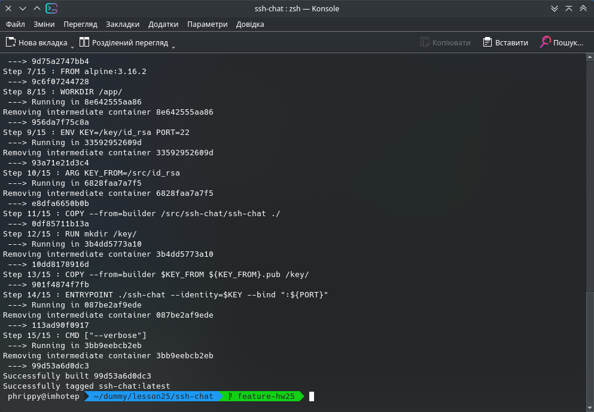

Скрипт приймає в якості позиціних параметрів файл ssh-ключа і номер порту. Варто зазначити, що для цих параметрів ми маємо значення за замовчуванням, прописані в Dockerfile. Тому вказувати їх необов'язково, як і каталог для монтування в контейнер - ми можемо використовувати ключ, що прописаний в образі. Тоді скрипт можна замінити однією командою:

```bash
docker run -d --rm -p 2222:22 --name ssh-chat ssh-chat
```
Спробуємо зібрати образ командою `docker build -t ssh-chat .`:



Тепер напишемо скрипт, який запустить контейнер і передасть йому всі необхідні параметри:

`# cat connect.sh`
