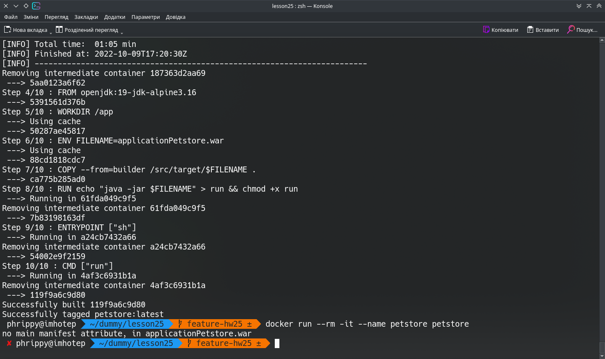
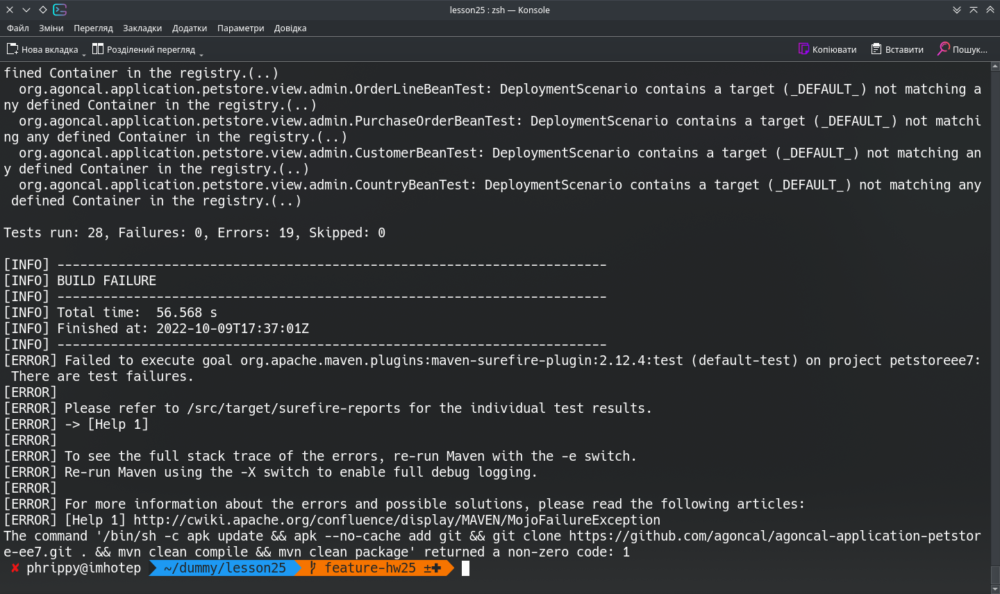

Збирання проходить за інструкцією розробника, але при спробі запуску отримуємо помилку:

Якщо ж пропустити тести, (тобто замість `mvn clean package -Dmaven.test.skip=true` написати просто `mvn clean package`), то тести проходять неуспішно і збирання провалюється:

