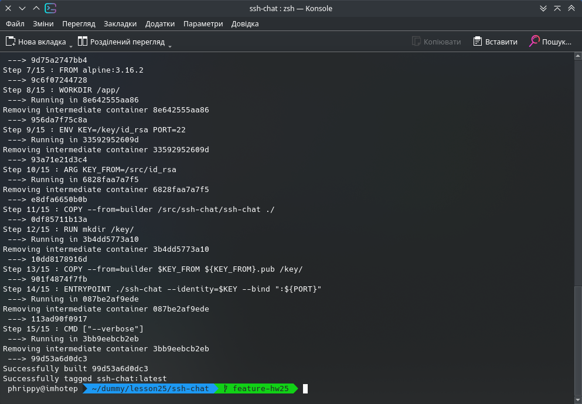
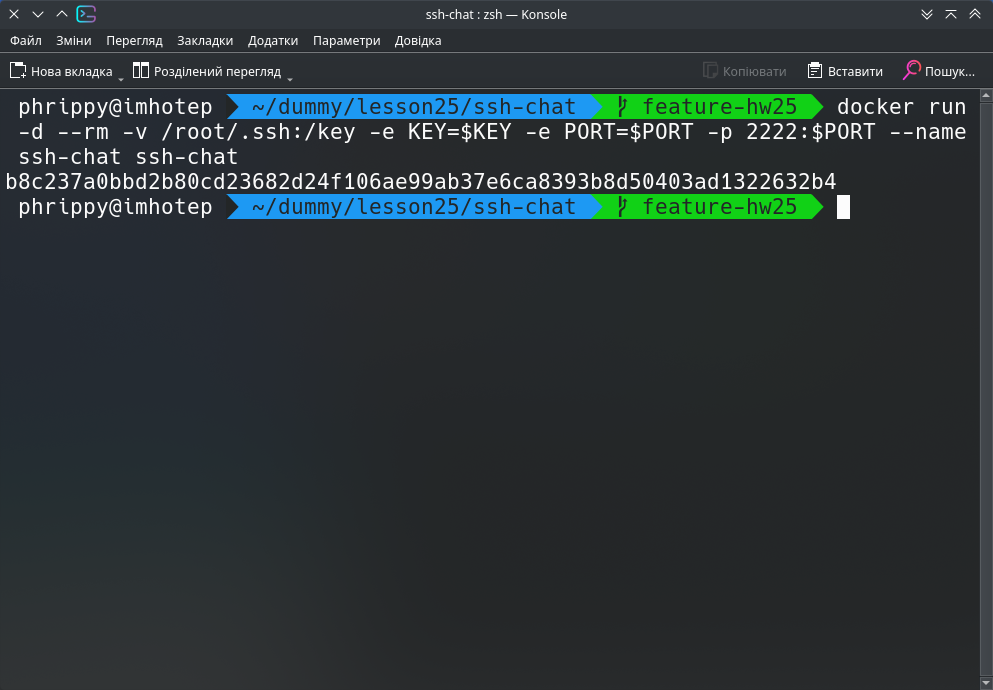
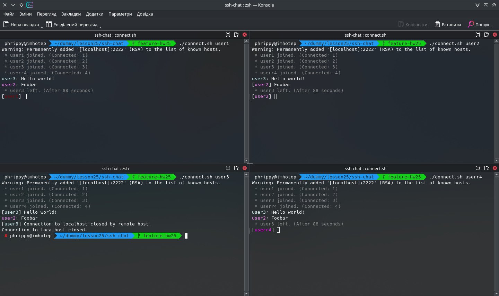
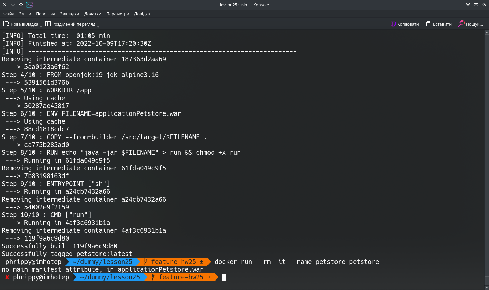
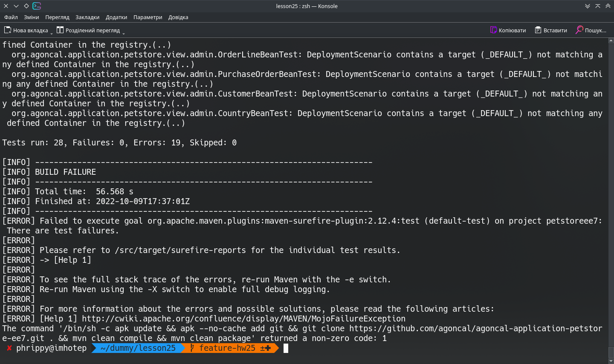

Спробуємо зібрати цей проект https://github.com/shazow/ssh-chat.git

Проект написаний на go, тому ми використаємо образ golang із dockerhub і довстановимо в нього деякі пакети, потрібні для збирання

Для цього напишемо відповідний Dockerfile:

```Dockerfile
FROM golang:alpine3.16 as builder
WORKDIR /src/
RUN apk add --no-cache git make openssh
RUN git clone https://github.com/shazow/ssh-chat.git
RUN cd ssh-chat && make build
RUN ssh-keygen -f ./id_rsa -P ''

FROM alpine:3.16.2
WORKDIR /app/
ENV KEY=/key/id_rsa PORT=22
ARG KEY_FROM=/src/id_rsa
COPY --from=builder /src/ssh-chat/ssh-chat ./
RUN mkdir /key/
COPY --from=builder $KEY_FROM ${KEY_FROM}.pub /key/
ENTRYPOINT ./ssh-chat --identity=$KEY --bind ":${PORT}"
CMD ["--verbose"]
```
Варто описати декілька моментів:

1.
```Dockerfile
RUN ssh-keygen -f ./id_rsa -P ''
```

Тут ми генеруємо ssh-ключ для серверу ssh-chat. Ім'я файлу і пароль (який задаємо пустим) ми вказуємо для того, щоб команда нічого не запитувала і, як наслідок, була неінтерактивною.

2.
```Dockerfile
ENV KEY=/key/id_rsa PORT=22
```

Тут ми задаємо змінні, які будуть доступні для ssh-chat. В майбутньому їх можна буде замістити під час запуску. Змінна PORT не несе особливого практичного значення, оскільки ми все рівно будемо прокидати цей порт на порт серверу. А от змінна KEY потрібна, щоб зберігати файл ssh-ключа окремо.

3.
Директиву EXPOSE ми не задаємо, оскільки наш контейнер не потребує взаємодії з іншими контейнерами. А для взаємодії з сервером достатньо опції `-p` при запуску контейнеру

Для збирання і запуску контейнеру можна написати такий скрипт:

`# cat build-and-run.sh` 

```bash
#!/bin/bash
docker build -t ssh-chat .
DEFAULT_KEY=/key/id_rsa
DEFAULT_PORT=12345
KEY=${1:-${DEFAULT_KEY}}
PORT=${2:-${DEFAULT_PORT}}
docker run -d --rm -v /root/.ssh:/key -e KEY=$KEY -e PORT=$PORT -p 2222:$PORT --name ssh-chat ssh-chat
```

Скрипт приймає в якості позиціних параметрів файл ssh-ключа і номер порту. Варто зазначити, що для цих параметрів ми маємо значення за замовчуванням, прописані в Dockerfile. Тому вказувати їх необов'язково, як і каталог для монтування в контейнер - ми можемо використовувати ключ, що прописаний в образі. Тоді скрипт можна замінити однією командою:

```bash
docker run -d --rm -p 2222:22 --name ssh-chat ssh-chat
```
Спробуємо зібрати образ командою `docker build -t ssh-chat .`:



Спробуємо запустити контейнер:



Тепер напишемо скрипт, який під'єднається до нашого сервісу:

`# cat connect.sh`

```bash
#!/bin/bash
USER=${1:-user}
ssh -o StrictHostKeyChecking=no -o UserKnownHostsFile=/dev/null $USER@localhost -p 2222
```

Додаткові опції при запуску ssh потрібні, щоб більш зручно тестувати проект в лабораторних умовах. Ми не будемо запитувати користувача і перевіряти ключ серверу, а будемо автоматично приймати його, записуючи в файл /dev/null, тобто не записуючи нікуди.

Оскільки наш сервіс передбачає підключення декількох користувачів, запустимо скрипт в чотирьох екземплярах і перевіримо функціональність:



Щодо збирання пропонованого в завданні проекту. Написав такий Dockerfile:

```Dockerfile
FROM maven:3.8.5-ibmjava-alpine as builder

WORKDIR /src

RUN apk update && apk --no-cache add git && \
git clone https://github.com/agoncal/agoncal-application-petstore-ee7.git . && \
mvn clean compile && \
#mvn clean package && \
mvn clean package -Dmaven.test.skip=true


FROM openjdk:19-jdk-alpine3.16

WORKDIR /app

ENV FILENAME=applicationPetstore.war

COPY --from=builder /src/target/$FILENAME .

RUN echo "java -jar $FILENAME" > run && chmod +x run

ENTRYPOINT ["sh"]
CMD ["run"]
```

Збирання проходить за інструкцією розробника, але при спробі запуску отримуємо помилку:



Якщо ж пропустити тести, (тобто замість `mvn clean package -Dmaven.test.skip=true` написати просто `mvn clean package`), то тести проходять неуспішно і збирання провалюється:


