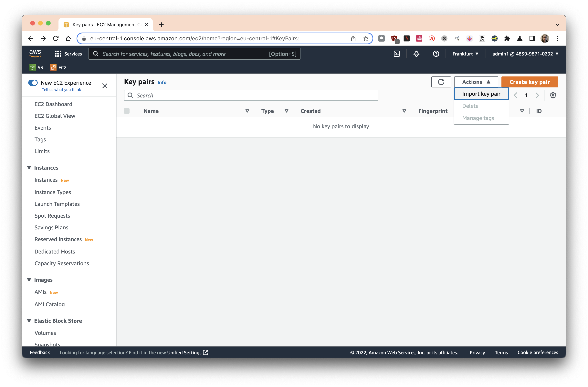
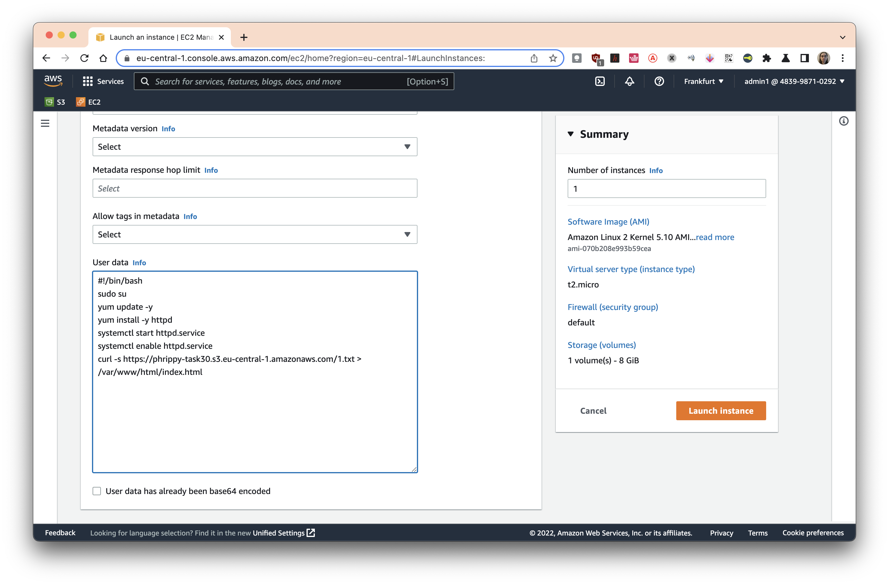
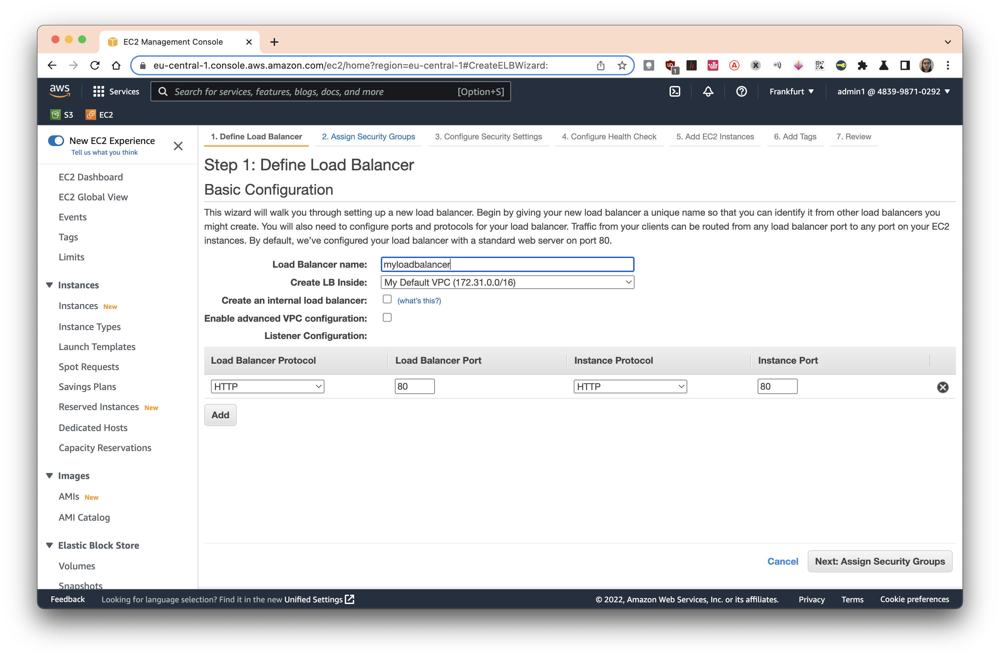
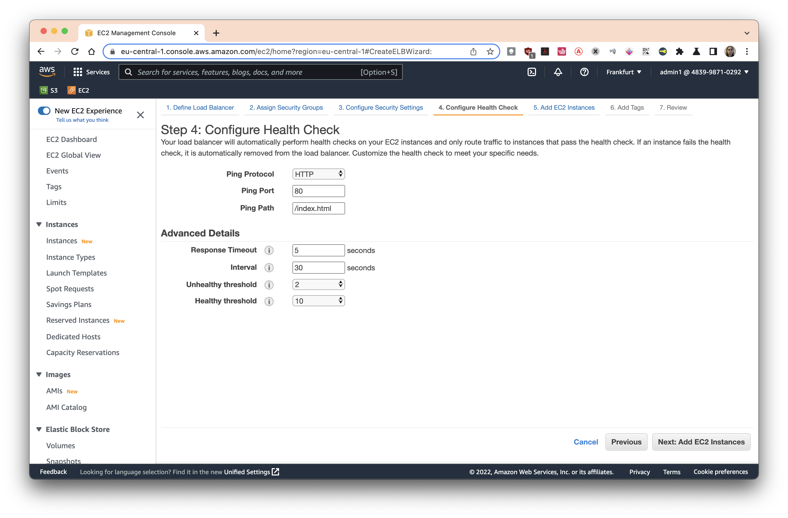

* зарегистрироваться в AWS Cloud. создать IAM пользователя.

* установить AWS cli, авторизовать его.

* создать 2 ЕС2, настроить к ним доступ через load balancer.

* создать две статических html страницы (например выводящих "1" и "2") для проверки работы лоад балансера.

* статические страницы разместить в S3. настроить хттп доступ к ним.

* настроить установку веб серверва и копирование статических страниц в ЕС2 при помощи user data. на двух виртуалках должны быть разные хтмл страницы (отчет - вывод разлиных страниц при обращении к ЕС2 через лоад балансер).

# Встановлюємо AWS cli

Спробуємо встановити AWS cli. Для цього скористаємося пакетним менеджером:


Як бачимо, встановлення успішно завершено:


Налаштуємо AWS cli, для цього запустимо команду `aws configure`


Як бачимо, було створено файли `~/.aws/config` і `~/.aws/credentials` 

# Створюємо S3

Знаходимо через пошук розділ `S3` і натискаємо кнопку `Create S3 bucket`. Вводимо унікальний Bucket name, вмикаємо ACLs:


Гортаємо вниз і знімаємо прапорець `Block all public access`. Ставимо прапорець `I acknowledge that the current settings might result in this bucket and the objects within becoming public.` Це потрібно для надання публічого доступу до наших даних


Всі інші опції залишаємо за замовчуванням. Натискаємо `Create bucket`:


S3 bucket успішно створено:


# Створюємо файли, які будуть надалі зберігатися в S3

Для цього скористаємось магією bash. Створимо файл 1.txt із вмістом `1` і 2.txt із вмістом `2`:

```bash
for i in 1 2 ; do echo -n $i > $i.txt ; done
```
# Завантажуємо файли в S3

Заходимо в наш новостворений S3 і натискаємо кнопку `Upload`:


Натискаємо кнопку `Add files` і завантажуємо файли 1.txt і 2.txt через стандартний інтерфейс браузера:


Розгортаємо блок `Permissions` і ставимо перемикач `Predefined ACLs` в положення `Grant public-read access`. Піднімаємо прапорець `I understand the risk of granting public-read access to the specified objects.`


Файли готові для завантаження в S3 bucket. Натискаємо кнопку `Upload`:


Як бачимо, файли успішно завантажено:


# Дістаємо посилання на файли

Відкриваємо наші файли в S3 bucket і зберігаємо Object URL:


Ми отримали два посилання:

* https://phrippy-task30.s3.eu-central-1.amazonaws.com/1.txt
* https://phrippy-task30.s3.eu-central-1.amazonaws.com/2.txt

Вони знадобляться нам для налаштування веб-серверів nginx

# Налаштовуємо фаєрвол

Ідемо в Security Groups і відкриваємо групу default, яку надалі будемо використовувати у віртуальних машинах. Натискаємо кнопку `Edit inbound rules`:


Відкриваємо порти 22 і 80 і нвтискаємо кнопку `Save rules`


Мережеві порти успішно налаштовано. В ідеалі, можна було б обмежити доступ до порту 22 лише для конкретної ip-адреси, але залишимо доступ для всіх


# Створюємо EC2

Заходимо в EC2 Dashboard:


Для початку створимо пару ssh-ключів. Заходимо в `Key pairs` і натискаємо `Create key pair` або `Actions -> Import key pair`, в залежності від потреби. Для простоти я імпортую свій ключ із локальної машини, але в ідеалі треба створити новий:



Імпортуємо ключ з локальної машини (вивід команди `cat ~/.ssh/id_rsa.pub`):


Ключ успішно імпортовано:


Тепер прийшла пора створити віртуальну машину, вона ж EC2. Натискаємо кнопку `Launch instance` в EC2 Dashboard.

Вводимо імʼя, наприклад `server1`:


Обираємо раніше створений нами ssh-ключ:


Встановлюємо security group для EC2 - обираємо default для спрощення роботи:


Розгортаємо блок `Advanced details` і гортаємо в кінець, до поля `User data`. Заповнюємо його вмістом скрипта, який встановить, налаштує і увімкне nginx:

```bash
#!/bin/bash
sudo su
yum update -y
yum install -y httpd
systemctl start httpd.service
systemctl enable httpd.service
curl -s https://phrippy-task30.s3.eu-central-1.amazonaws.com/1.txt > /var/www/html/index.html
```

Налаштування EC2 завершено, натискаємо кнопку `Launch instance`:



Чекаємо, поки EC2 не набуде статусу `Running` і відкриваємо сторінку з деталями:


Як бачимо, віртуальна машина має публічні IP та DNS-імʼя. Спробуємо відкрити IP в браузері:


Схоже, все працює. Створимо ще одно віртуальну машину EC2, але тепер скопіюємо інший файл як основну сторінку для nginx:

```bash
#!/bin/bash
sudo su
yum update -y
yum install -y httpd
systemctl start httpd.service
systemctl enable httpd.service
curl -s https://phrippy-task30.s3.eu-central-1.amazonaws.com/2.txt > /var/www/html/index.html
```

# Створюємо Load Balancer

Відкриваємо сторінку Load Balancer і натискаємо кнопку `Create Load Balancer`:


Обираємо `Classic Load Balancer` і натискаємо `Create`:


Тут просто обираємо імʼя для балансера і натискаємо Next:



Тут обираємо вже існуючу групу Default:


Це попередження можна проігнорувати, оскільки в нас тестовий стенд і трафік без шифрування по протоколу HTTP. В реальних умовах, звісно ж, потрібно налаштувати HTTPS-доступ


Параметри healthcheck залишаємо за замовчуванням, тут вони повністю підходять:



Обираємо наші дві віртуальні машини EC2 і додаємо їх в Load Balancer:


На даному етапі теги нас не цікавлять, тому просто натискаємо `Review and Create`:


Перевіряємо, чи все правильно і тиснемо `Create`:


Відкриваємо вкладку `Instances` і пересвідчуємося, що обидві віртуальні машини перебувають в статусі `InService`:


В стовпці `DNS name` знаходиться DNS-імʼя Load Balancer-а. Звісно, можна відкрити DNS-імʼя `myloadbalancer-1211606296.eu-central-1.elb.amazonaws.com` в браузері, але це скріншот не покаже його інтерактивної роботи. Тому для наглядності напишемо простенький скрипт:

```bash
#!/bin/bash
URL='myloadbalancer-1211606296.eu-central-1.elb.amazonaws.com'
for i in {1..9} ; do
    echo "Attempt $i: $(curl -s ${URL})"
		sleep 1
done
```
